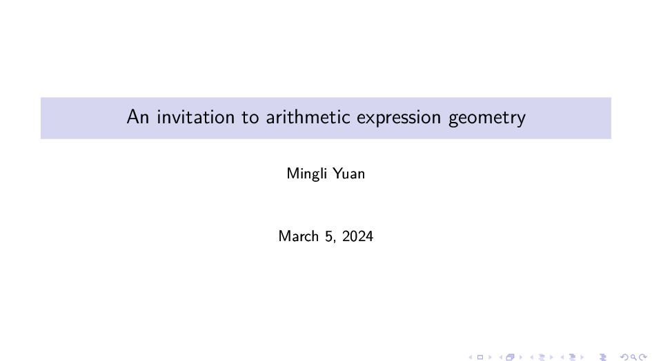
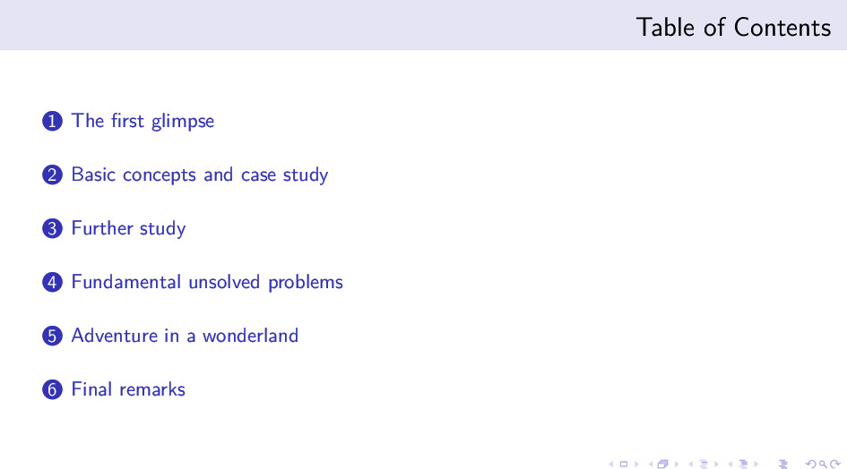
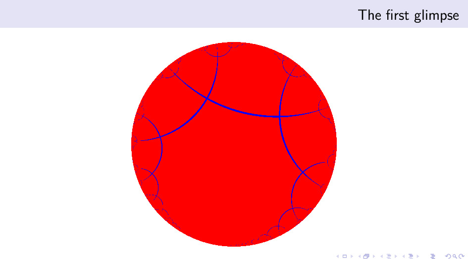
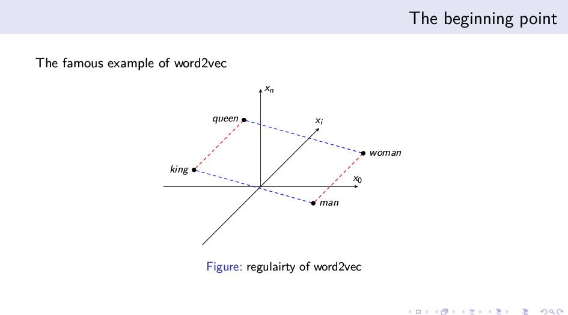
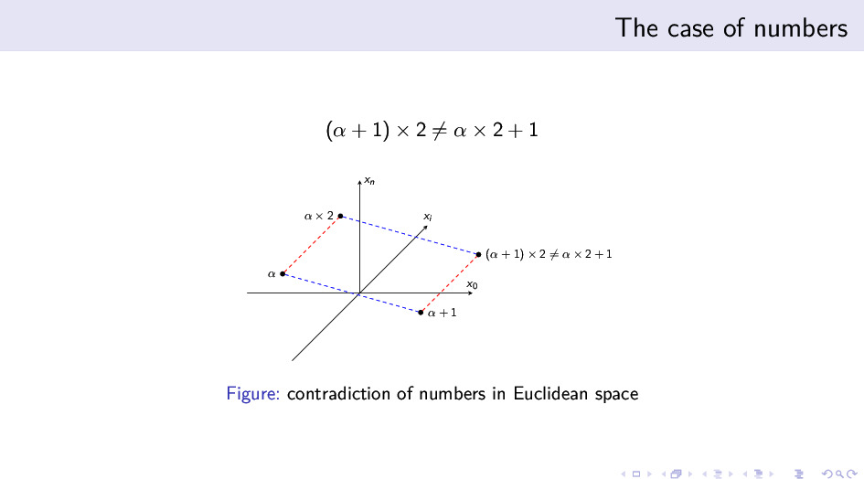
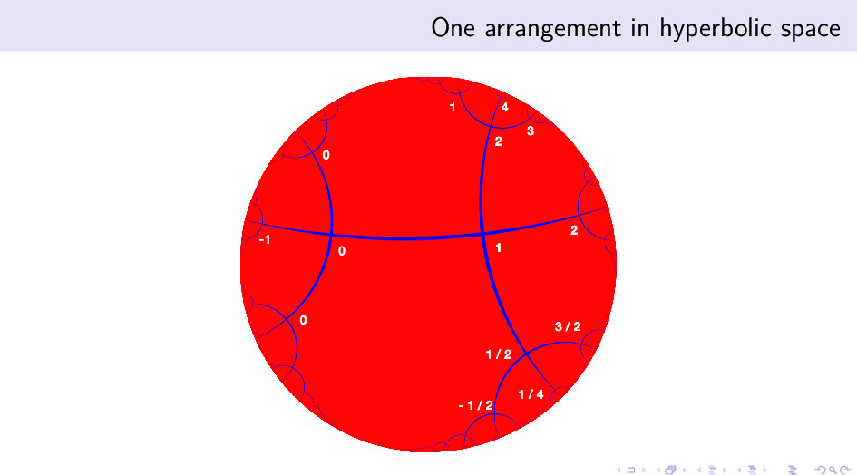

+++
title = "来自算术表达式几何的邀请"
description = ""
date = 2024-03-07
weight = 0
draft = false

sort_by = "date"
paginate_by = 5
paginate_path = "page"
insert_anchor_links = "none"
in_search_index = true

template = "section.html"
page_template = "page.html"
transparent = false

+++

序言

> 我们在未知的海岸边发现了一串奇怪的脚印...... —— 亚瑟·爱丁顿

我深知自己智力和能力的有限，然而当你面对浮现出来的这些有趣问题时，当你感觉到这些问题背后可能的前景时，你是否会选择远航出发，去探索一片未知的海域？
我在 2022 年初的选择是“出发”。尽管大量的问题没有解决，经过两年多的整理和探索，我逐步可以用相对严格的语言来陈述这些问题了。
所以，我想邀请大家一起来探索这片未知的海域。这个演示文档是我对这个领域的一个简要介绍，希望能够引起大家的兴趣，也希望能够得到大家的指正和帮助。

下载：[演示文档](/curiosity/invitation/invitation.pdf)、中文文稿、英文文稿

---

封面

《来自算术表达式几何的邀请》

目录

* 缘起与快速一瞥
* 基本概念与示例
* 进一步的研究
* 基础性的未解决问题
* 更狂野的想法
* 结语

---

### 第一节：缘起与快速一瞥

整个的探索大概可以从 2015 年开始。在 2013、2014 年的时候，自然语言处理里的词嵌入技术刚刚被发展出来，引发了大量的研究与讨论。
它最吸引人的地方在于这种分布式表征的词向量，可以捕捉到词语之间的语义关系，被称为“正则性”（regularity）。
这种正则性是指，如果两对词语在语义关系上有相似性，那么它们的词向量之间的关系也应该有几何上的平行性。
正则性是词语关系的一种几何化表达，它是词向量的一个重要性质。

最为著名的例子是“男人”和“女人”之间的关系，与“国王”和“王后”之间的关系。这两对词语之间的关系是相似的，所以它们的词向量之间的关系也应该是平行的。
在上图的例子中，我们可以看到两组平行关系：

* 性别维度移动：男人 - 女人 ≈ 国王 - 女王
* 王权维度移动：国王 - 男人 ≈ 女王 - 女人

这两组关系之间的平行性，形成一个平行四边形。同时，这两组平行关系也可以看成一种关系矢量上的运算，用几何语言说就是：

* 男人 + 性别维度移动 + 王权维度移动 = 女王
* 男人 + 王权维度移动 + 性别维度移动 = 女王

也就是说：

* 性别维度移动 + 王权维度移动 = 王权维度移动 + 性别维度移动

这反映了关系运算的交换律。

现有的算法对这种关系正则性的捕捉是有限的，以后的技术发展并没有沿着这个方向继续前进，而是转向了更加复杂的模型和任务。而我思考的起点就是从这里延伸出来的。
如果我们把这种关系正则性强制要求下来，会发生什么呢？我去拿数字和数字的运算关系做了一些尝试，但很快就发现它存在一些困难。

这个困难可以精炼的表述为两点：运算关系不具备交换性，从而无法形成平行四边形；欧式空间的容量是有限的，无法容纳指数爆炸的运算关系组合。
让我们举例子来说明一下，我们考察简单的“+1”和“x2”的关系。此时，所有的数字都映射为空间的点，而“+1”和“x2”运算关系映射为空间的向量。

从一个点 $\alpha$ 出发，我们可以进行一系列的运算关系组合，比如：
* 先“+1”再“x2”操作：$(\alpha +1) \times 2 = 2 \alpha + 2$
* 先“x2”再“+1”操作：$\alpha \times 2 + 1 = 2 \alpha + 1$

不论我们从哪个点出发，这两个运算关系都不具备交换性，所以它们无法形成平行四边形。
平行四边形的存在也意味着两次关系运算的组合中可以约化掉一个，从而可以避免运算关系组合的指数爆炸。
而关系不具备交换性，平行四边形就无法形成，指数爆炸的运算关系组合也就无法避免。

如果每个表征在空间里都占据有限大的体积，且这个有限大的体积存在一个最小的分辨限制，那么组合爆炸就意味着我们需指数增长的体积来容纳这些运算关系的组合。
在欧式空间里，球体的体积随着半径增长是多项式级别增长的，所以随着表达式数量的增加，表征空间会很快不足够使用。

幸运的是，几何学里有一种空间，它的容量指数增长的，同时它里面也不存在平行四边形构造，这就是双曲空间。我决定拿双曲空间来尝试解决这个问题。

### 第二节：基本概念与示例

### 第三节：进一步的研究

### 第四节：基础性的未解决的问题

### 第五节：更狂野的想法

### 第六节：结语

