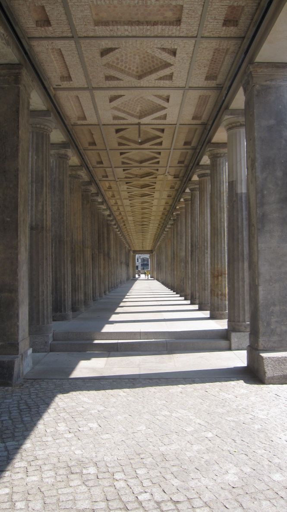
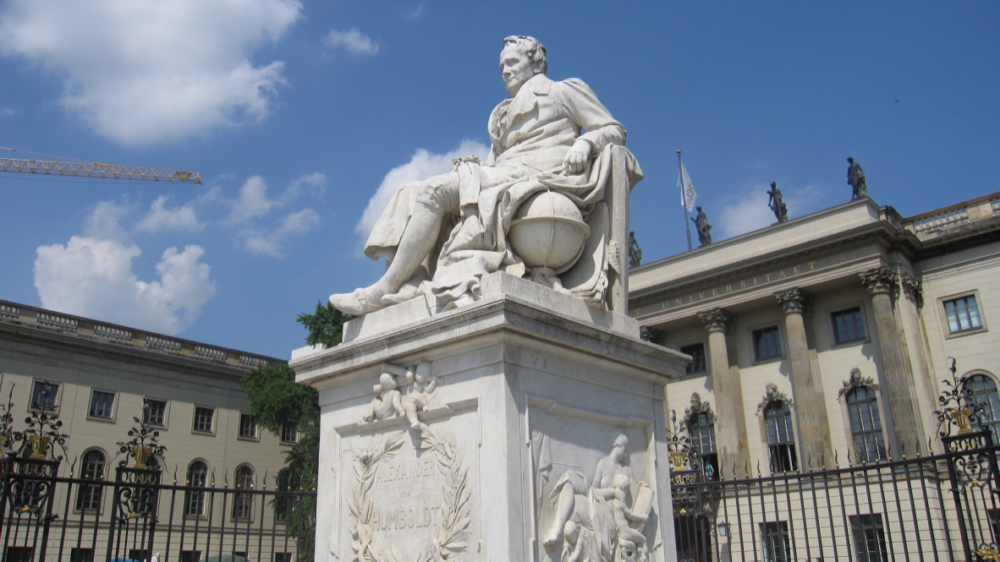

+++
title = "柏林"
description = ""
date = 2010-07-06
weight = 6
draft = false

sort_by = "date"
paginate_by = 5
paginate_path = "page"
insert_anchor_links = "none"
in_search_index = true

template = "section.html"
page_template = "page.html"
transparent = false

+++

2010年夏天去参加 Wikimania，在德国南方走了几个城市后，我坐火车去了柏林。
一路上火车快速穿行于山岭中，间或有些原野，可以想象铁路修建的成本不低。

到柏林后，一开始住在博物馆岛附近，后来转去了朋友家里。

比起南方的小城，感觉起来，柏林明显是个大城市，嘈杂了很多。

能看到德国人对历史的记忆和反思。

当然，也忘不了去柏林墙一观。

