+++
title = "法兰克福"
description = ""
date = 2010-07-12
weight = 8
draft = false

sort_by = "date"
paginate_by = 5
paginate_path = "page"
insert_anchor_links = "none"
in_search_index = true

template = "section.html"
page_template = "page.html"
transparent = false

+++

2010年夏天参加 Wikimania 后，回国途中在法拉克福中转一日，匆匆之间留下一些记录。

法拉克福是美因河畔法拉克福的简称，因为在德国东部有奥得河畔法兰克福。下午下的飞机，其后来到旅馆，放下行囊，在城中行走，一会儿就来到来到河畔。
水面开阔，虽然很平静，但能感觉到水流不小。河的侧面有林荫路。

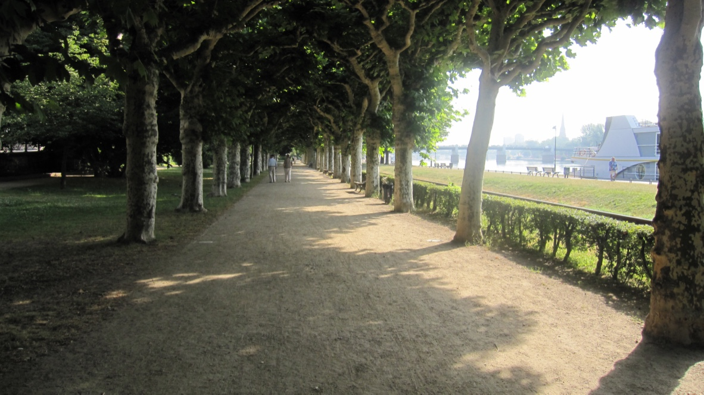

第二天一早来到老城的中心 Römerberg（罗马山）广场，这里因中世纪建筑 Römer 得名，后者有 600 年的历史曾经是法兰克福的市政厅。

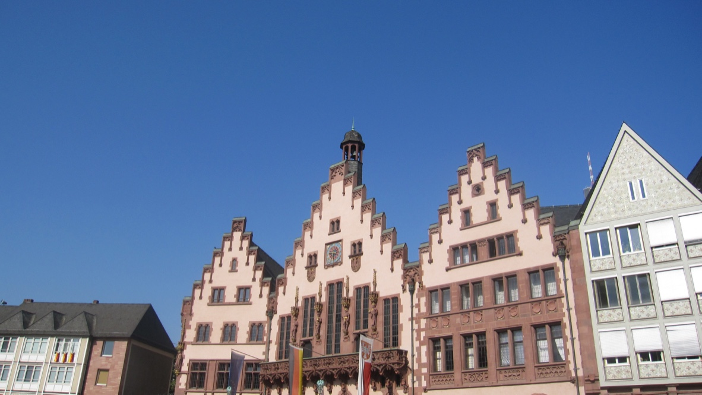

在 Römerberg 广场上矗立着一个雕塑，如果没有弄错，应该是掌管公平的女神 Aequitas。这里有一些店铺，我在这里品尝了有名的德国大肘子。

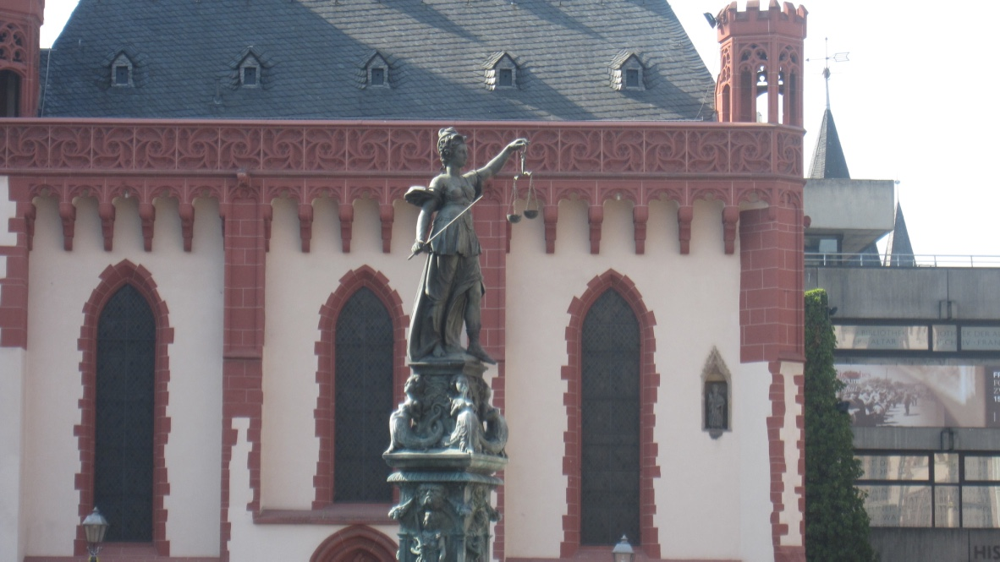

在法拉克福大教堂附近的街上行走，当时教堂正在维修，只能从外面看看。但街面上有一些特色建筑和街头的艺术。

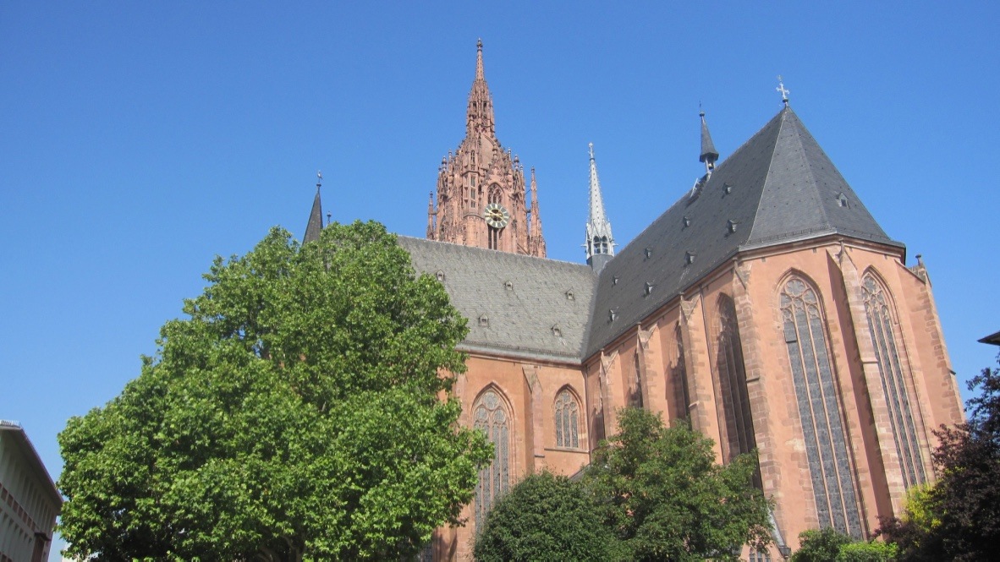
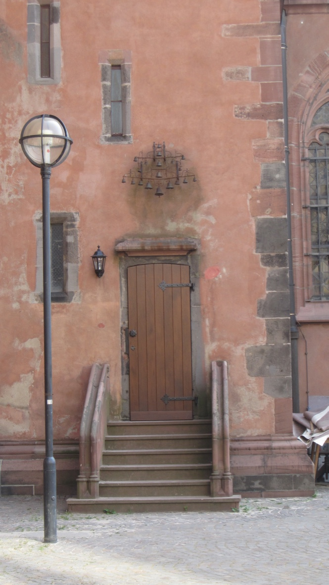
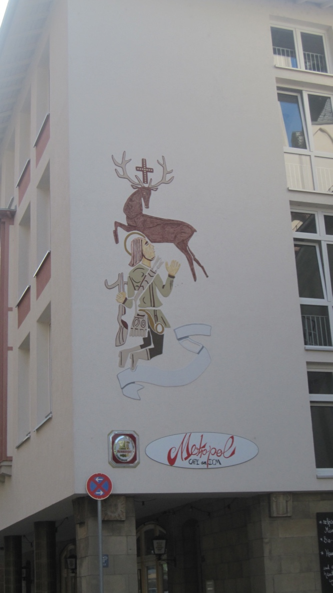
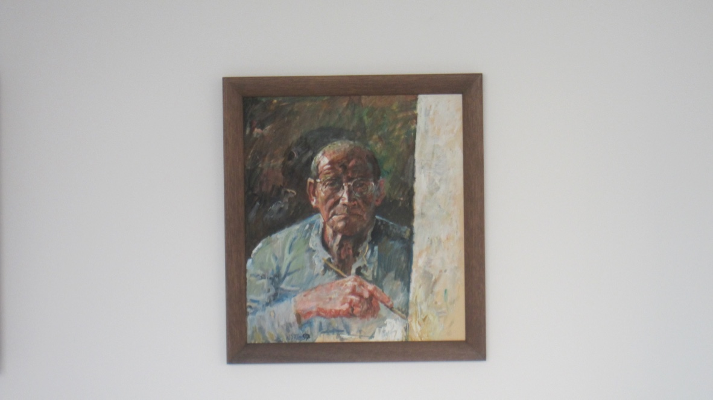

我又钻进了居民区的市场一窥究竟，各色菜品、水果一应俱全，当然少不了香肠和泡菜。

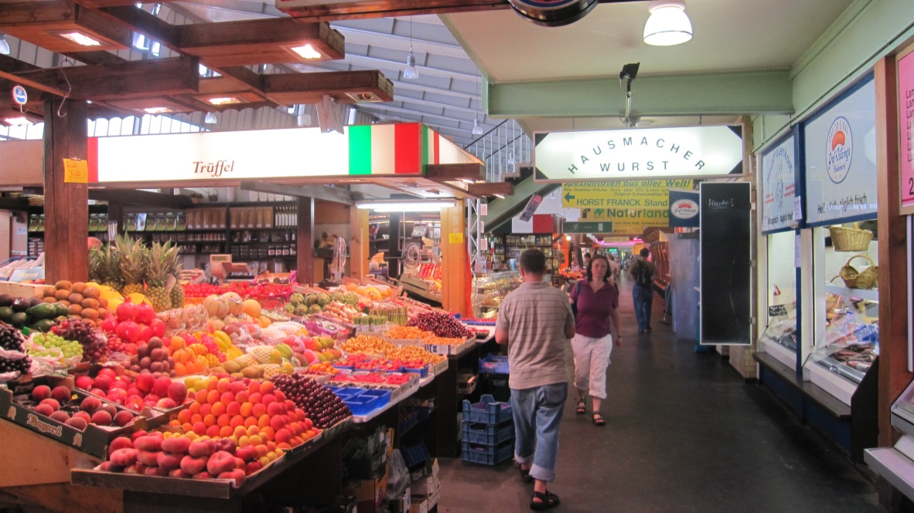
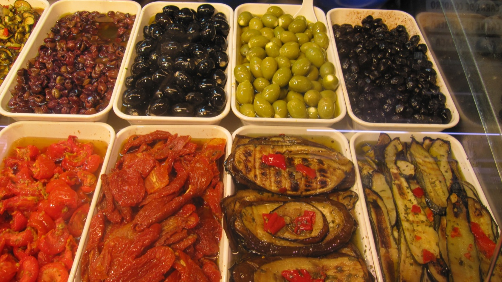

下午则在步行街 Zeil 盘桓了半日。记得入口处有买香肠的小摊，吃了一点简单果腹，继续在城中转转。
Zeil 步行街区的面积不小，模糊的印象中比王府井、南京路要大很多。街上也有街头艺人的表演。

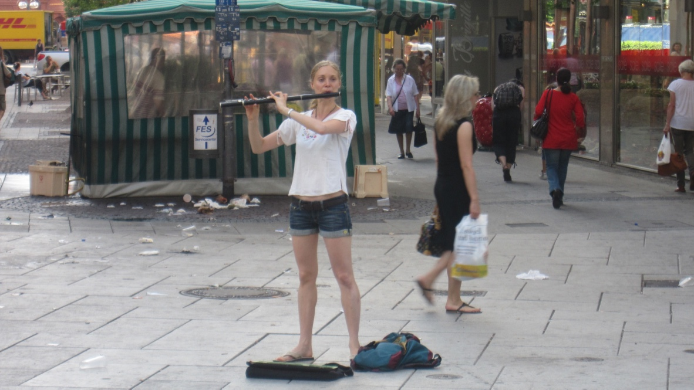

法兰克福的最后一站是歌德故居，歌德在此出生。故居在金融区和老城区的交界处，是一座传统庭院，而在那一墙的绿植后面就是高耸的现代建筑。

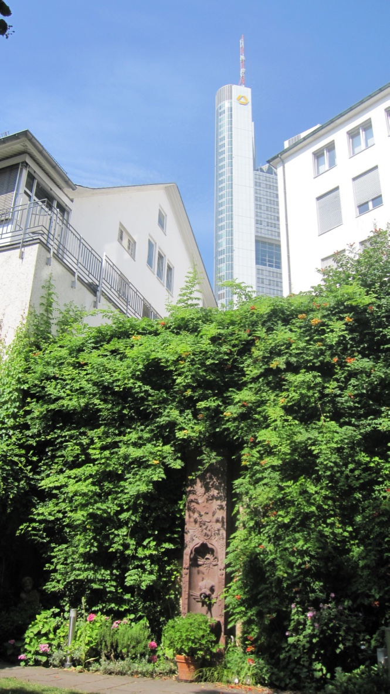

