+++
title = "格但斯克"
description = ""
weight = 7
draft = false

sort_by = "date"
paginate_by = 5
paginate_path = "page"
insert_anchor_links = "none"
in_search_index = true

template = "section.html"
page_template = "page.html"
transparent = false

[extra]
date = 2010-07-09

+++

2010 年夏去参加 Wikimania，会址在波兰的格但斯克（Gdansk）。格但斯克过去有翻译称但泽，曾经是德国的领地，战败后归属了波兰。
还是第一次去往波兰，出发前有些好奇，查阅了些资料，他们是斯拉夫人， 但信仰天主教，文字也是拉丁文。一些熟知的故事，比如居里夫人与金属钋的故事，
音乐家肖邦，近代波兰的数学学派……还有记得小时候看新闻里的瓦文萨、团结工会……发现哥白尼葬在离格但斯克不远的小城弗龙堡（Frombork），
但时间有限不能去探索了。

我一大早从柏林出发，坐着大家笑称的一辆"维基专列"，和很多小伙伴一起去往格但斯克。火车走在中欧平原上，路过一些德国东部的小镇，显得很破败，
人口稀少的样子。应该是在下午到达了港口城市格但斯克。

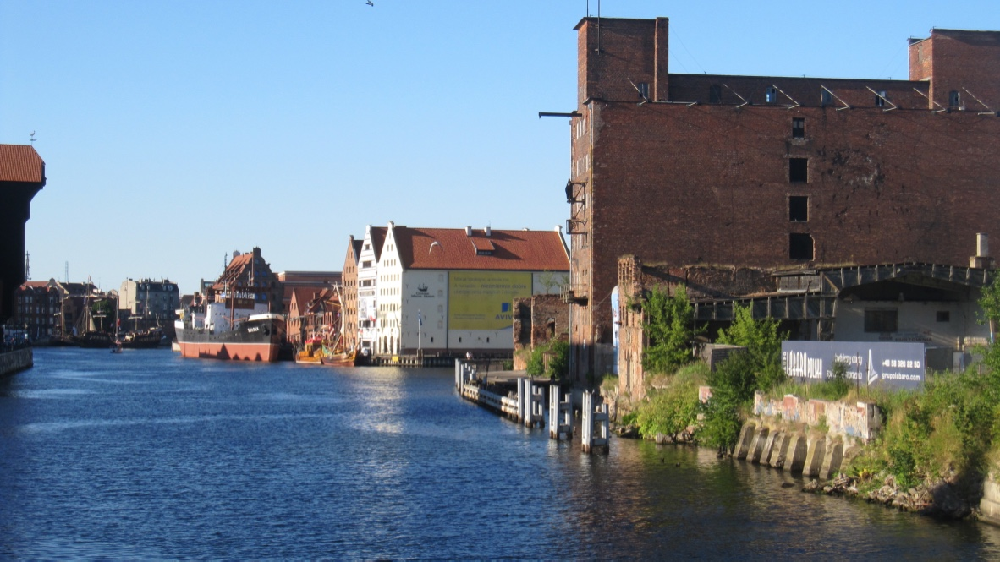

虽说是个城市，并不是很大。城市里的很多建筑都有些老旧，在我这个外国人看来挺有风味，港口边的格但斯克酒店倒是焕然一新。

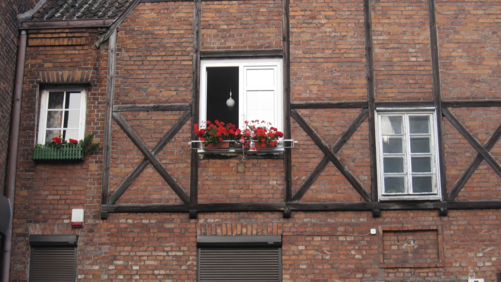
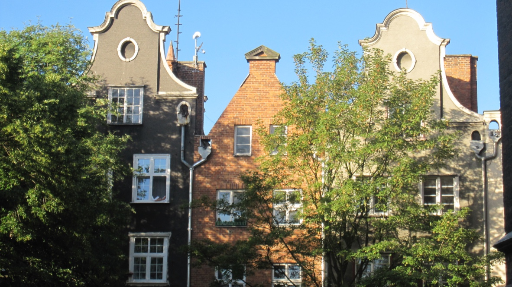
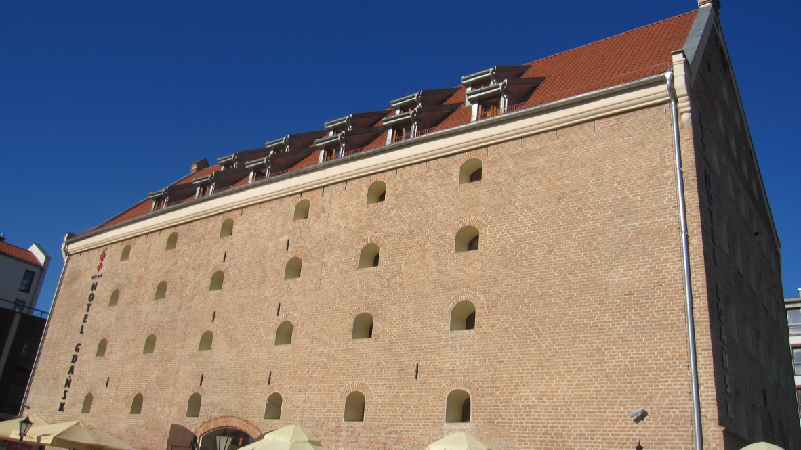
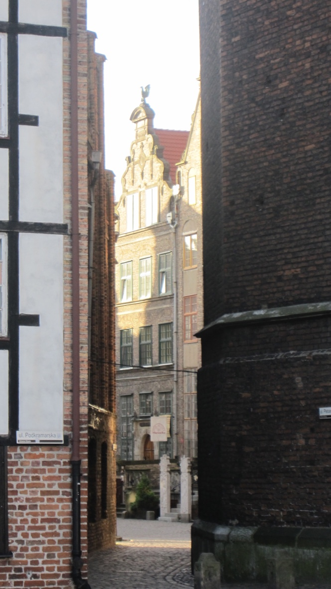

大约三天的会议，我每天早晨很早就起来，抽空在小城里探索一番。有纪念天文学家约翰·赫维留斯的小广场，我后来查到他是月面学的奠基人。
市镇的中央有老教堂，里面的耶稣像很独特。

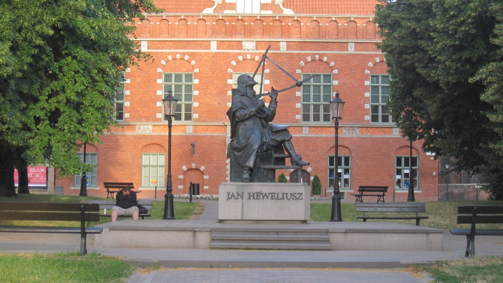
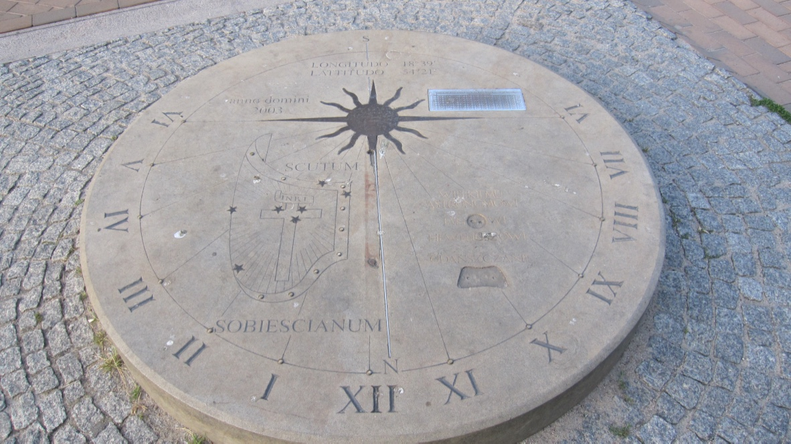
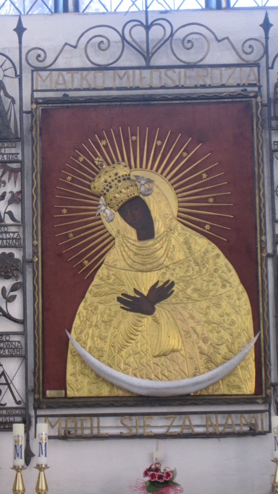

市内也有个谷仓的遗址，看介绍后才知道对中世纪的城市，谷仓在城市防御上非常重要。

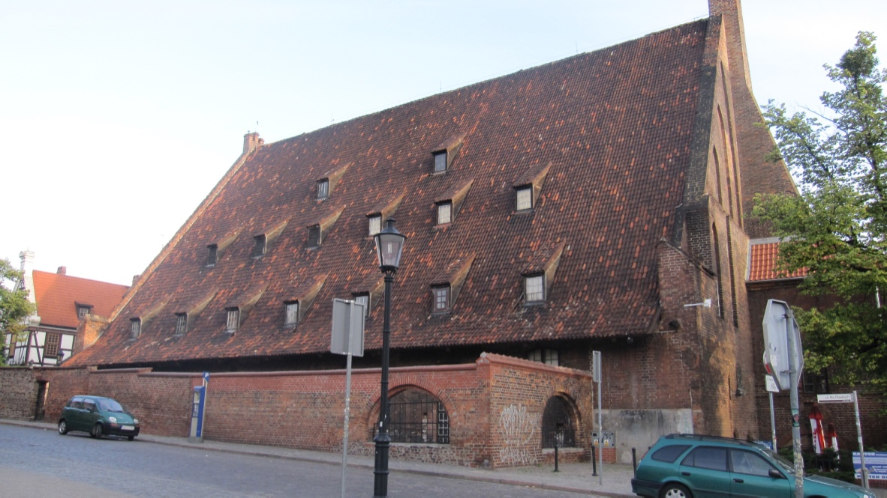

在酒吧里进餐，歌手的歌声非常动听。

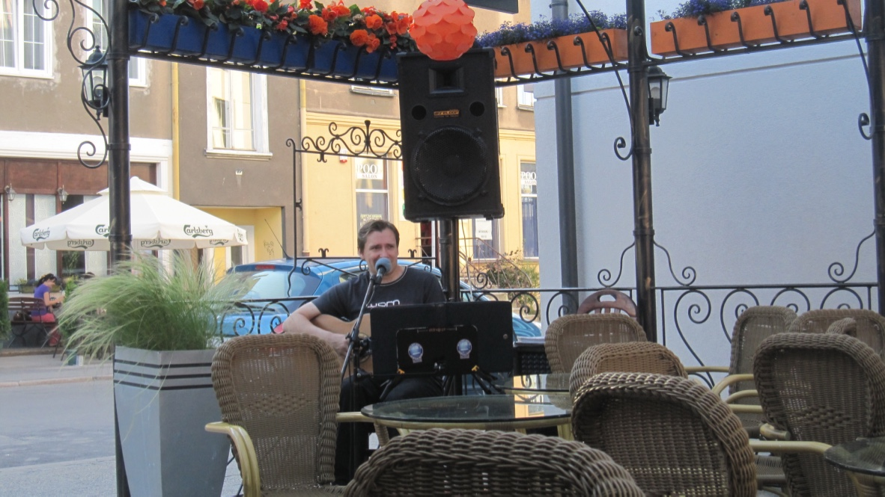

十几年后的今天，仍然依稀记得，那天傍晚有一艘帆船缓缓驶入河道停靠码头。

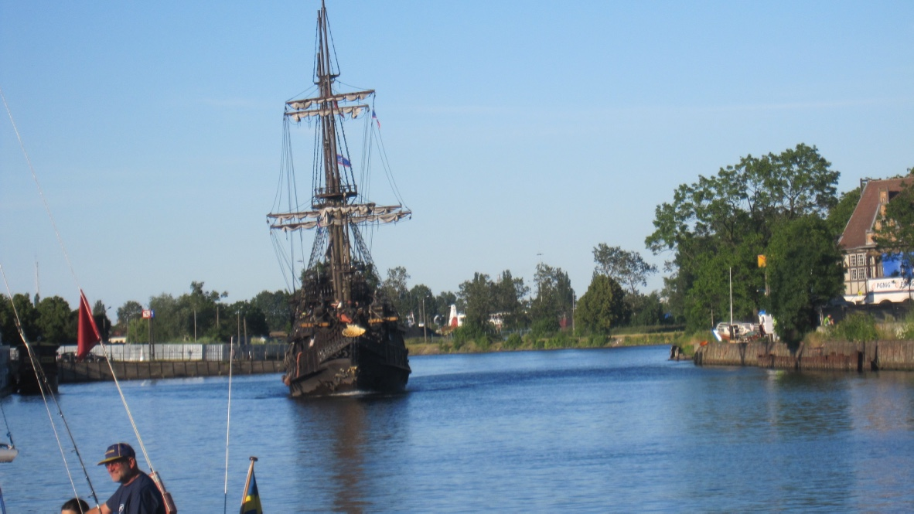

时间流逝不止，过去一麟半爪的记忆尽管鲜活，可那些懵懂的时光再也回不来了！

