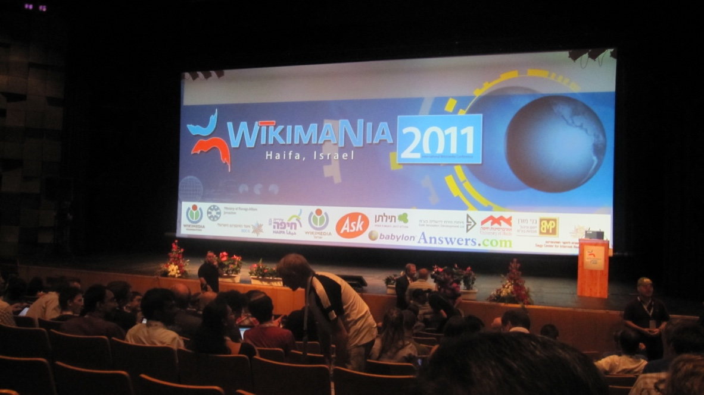
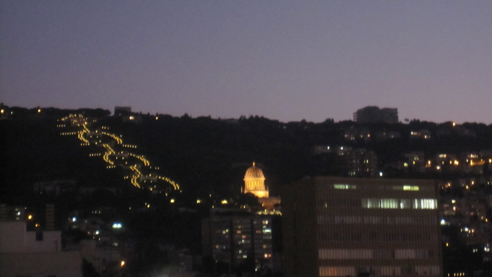
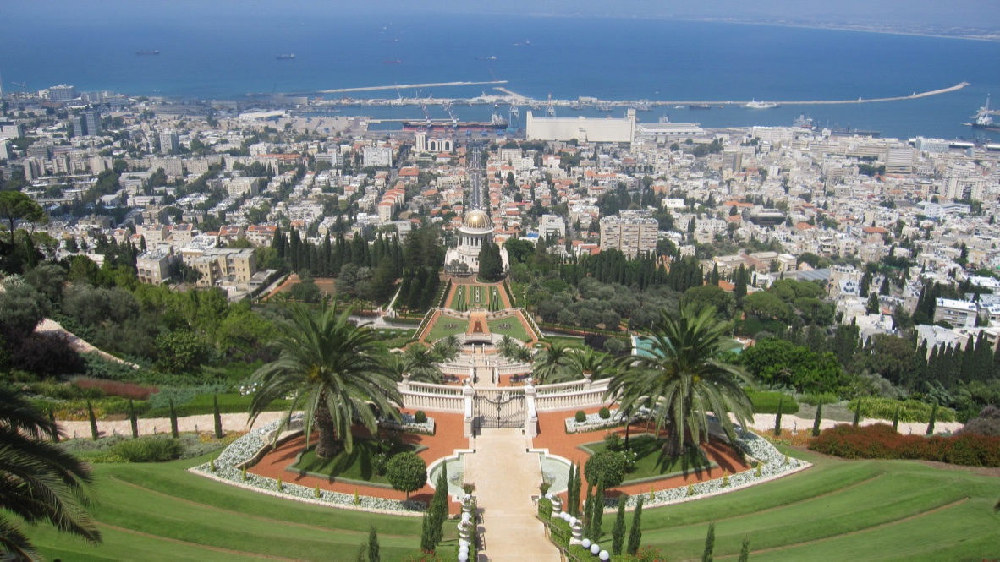
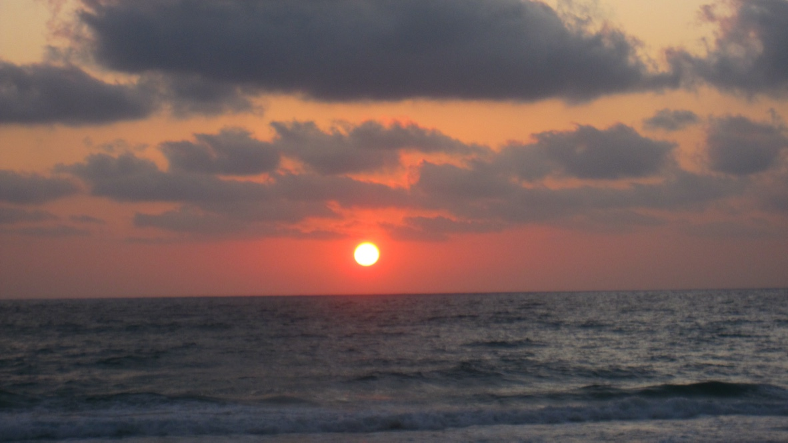

+++
title = "海法"
description = ""
date = 2011-08-02
weight = 9
draft = false

sort_by = "date"
paginate_by = 5
paginate_path = "page"
insert_anchor_links = "none"
in_search_index = true

template = "section.html"
page_template = "page.html"
transparent = false

+++

2011年夏天参加了在海法举行的 Wikimania，去了以色列。听我父亲说他幼时巴以就有冲突，历经过几次中东战争，如今父亲已经垂垂老矣，
而这人间的悲剧仍然无解。拉宾和阿拉法特拉开了和平的序幕，却以拉宾被刺杀而告终。这些背景知识从电视上可以知道，但并没有切身的体会。
直到在飞机上，一个阿族青年告诉我以色列人有多么坏；在土耳其转机时，极为严苛的安全检查，我才略有体会。所幸，我没有经历那里的战场，
而是去往一个以各宗教和平相处而闻名的城市—海法。

飞机缓缓下降，飞越过一些丘陵地带，这里就是上帝的"应许之地"；首先是到达了特拉维夫，由此转乘去往海法。海法在地中海旁边，
我也是从这次旅行中才知道，这里的港口附近也有租界；只是不知道这个词对当地人意味着什么？中东的历史错综复杂，各种力量在此交替出现。

会议是在以色列理工大学举行。我在会址旁边的大露台上拍摄到了夜幕下的巴哈伊花园，这里是巴哈伊信仰的圣地。

当时的会议感想[另有一文](/essay/travel/wikimania/)，是十多年前的想法，如今世事变迁，心境已然不同……

拍摄到了日暮之下的地中海。

