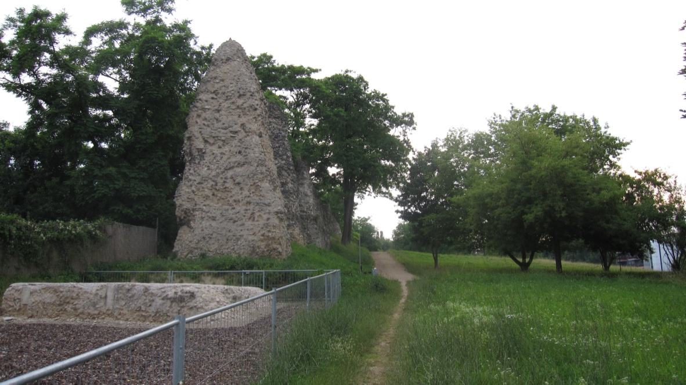
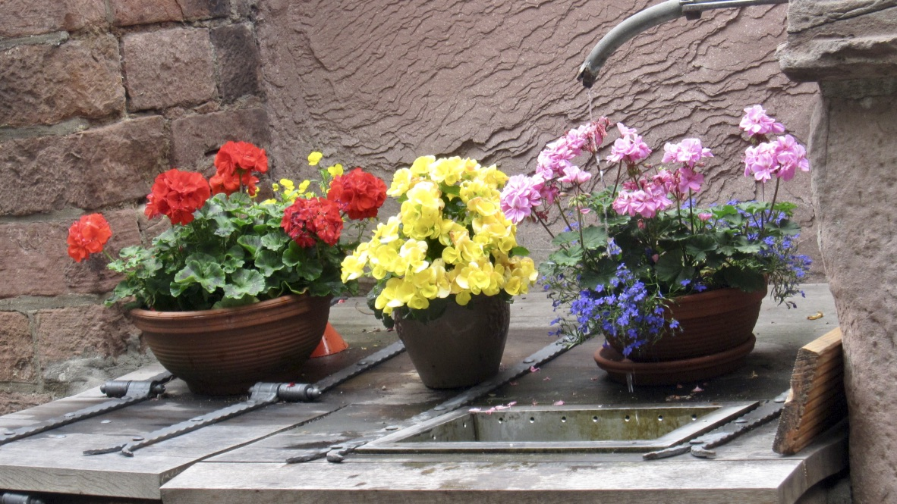

+++
title = "海德堡"
description = ""
date = 2010-07-06
weight = 1
draft = false

sort_by = "date"
paginate_by = 5
paginate_path = "page"
insert_anchor_links = "none"
in_search_index = true

template = "section.html"
page_template = "page.html"
transparent = false

+++

2010年夏天去参加 Wikimania，在法兰克福下了飞机，途中在朋友带领下去参观了德国南部的一些城市。
吃过早饭，朋友问我愿意去科隆、海德堡还是其他的选择？我在哥廷根和海德堡之间犹豫了一会，最后还是选择了海德堡。
毕竟是欧洲最古老大学的所在地。

到达海德堡之前，我们路过古罗马渠道的遗址，前去探看了一番。

可惜时间有限，没能走那条著名的哲人小径。

