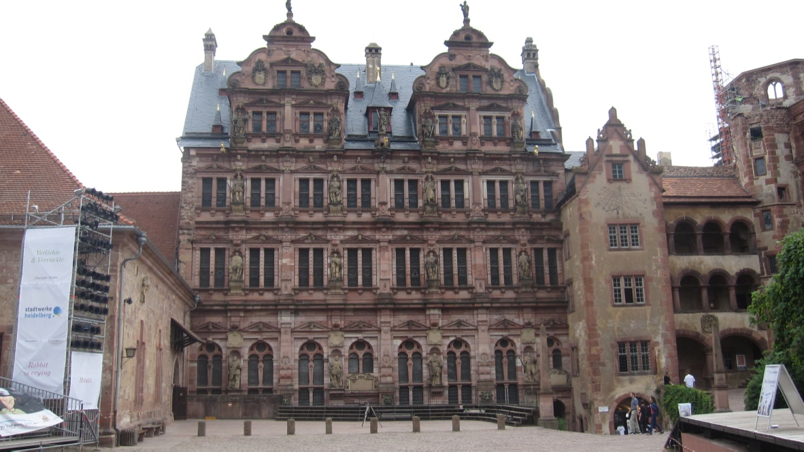

+++
title = "海德堡"
description = ""
date = 2010-07-06
weight = 5
draft = false

sort_by = "date"
paginate_by = 5
paginate_path = "page"
insert_anchor_links = "none"
in_search_index = true

template = "section.html"
page_template = "page.html"
transparent = false

+++

2010年夏天去参加 Wikimania，在法兰克福下了飞机，途中在朋友带领下去参观了德国南部的一些城市。
吃过早饭，朋友问我愿意去科隆、海德堡还是其他的选择？我在哥廷根和海德堡之间犹豫了一会，最后还是选择了海德堡。
毕竟是欧洲最古老大学的所在地。

到达海德堡之前，我们路过古罗马渠道的遗址，前去探看了一番。

走入老城，在谷物市场就已经能远远望见山顶的宫殿。因为德国南部信仰天主教，所以有圣母像。

我们首先就去了王座山上的宫殿遗址，这里是几代选帝候的住所。历史上德国曾经有国王的选举制度，
从七位诸侯中选举出神圣罗马帝国的皇帝。这些诸侯就被称为选帝候。
1689年这些宫殿毁于战火，后虽重修，但仍然在遭遇雷击后毁掉。

残留的墙壁上还有历代选帝候的雕像。

穿过一道门，来到平台，可以俯瞰整个老城，也能看到内卡河上有一座桥。

老城里，人熙熙攘攘。

最有趣的是，我们来到桥头，发现了一座狒狒的铜像，还写有一首富有哲理的诗，作者是17世纪的马丁·蔡勒。
* 嘿，你干啥在这儿瞪眼瞧着我？
* 难道你没有看见海德堡的老猴？
* 我劝你不妨回头看看你的四周
* 就会发现我的同类还有许许多多。

走到了一个安静的街巷，一家门旁摆放的几盆鲜花被我拍下。
那种闲静里的美就是我对整个南德的印象。可惜时间有限，没能走那条著名的哲人小径。

