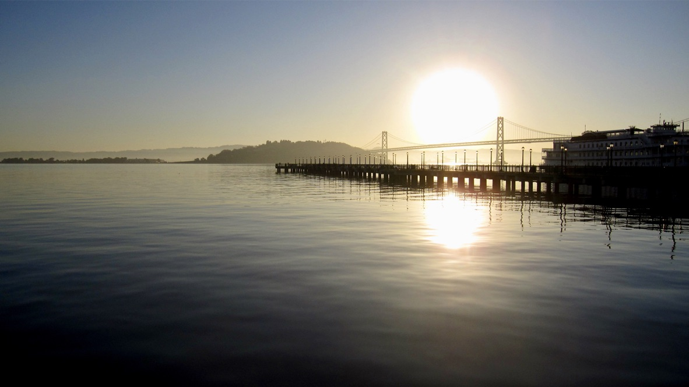
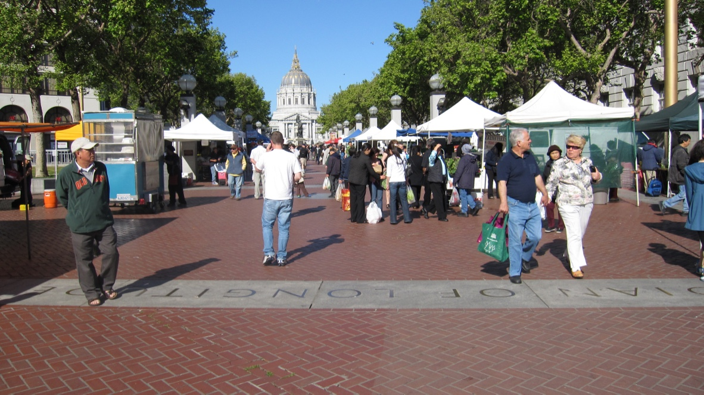
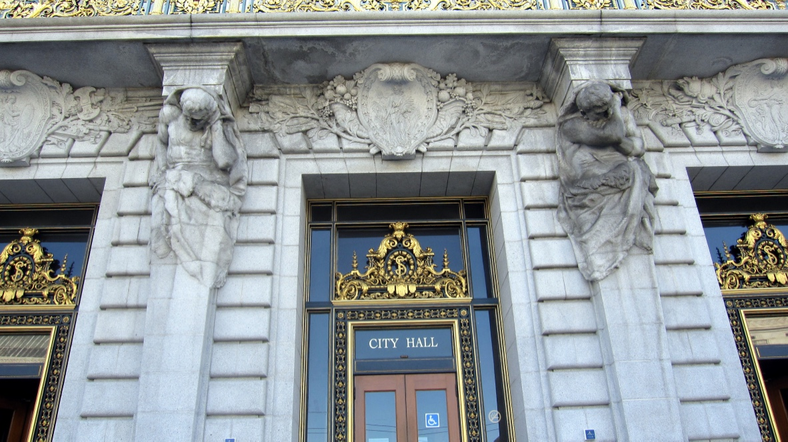
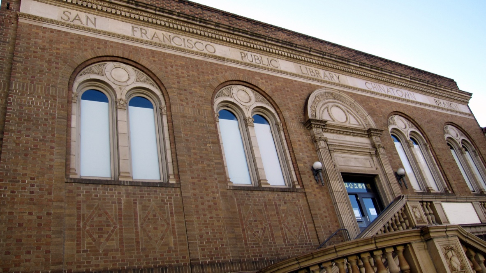

+++
title = "旧金山"
description = ""
date = 2019-04-19
weight = 4
draft = false

sort_by = "date"
paginate_by = 5
paginate_path = "page"
insert_anchor_links = "none"
in_search_index = true

template = "section.html"
page_template = "page.html"
transparent = false

+++

2009年春季项目结束之后，回国之前，去了旧金山，住在联合广场附近。

因为时间有限，早晨一大早就起来了，从码头附近开始探索

在楼群里穿行，早早的人很少，只有几个醉鬼，其中一个冲我大叫，我赶快走开。

来到市政大厅附近的广场，竟然有个集市，一大早很多车载着蔬菜进来。

市政大厅的门柱上有两个巨人雕像，像是在托住人间疾苦。

中午在唐人街吃的混沌，但味道比较奇怪。附近有一座图书馆，有百年多历史，是早年在美华人自强、奋斗的体现。

