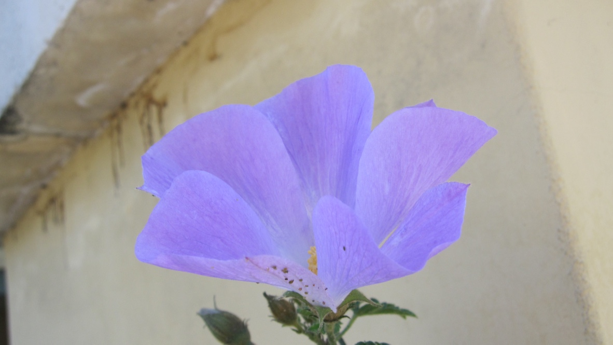
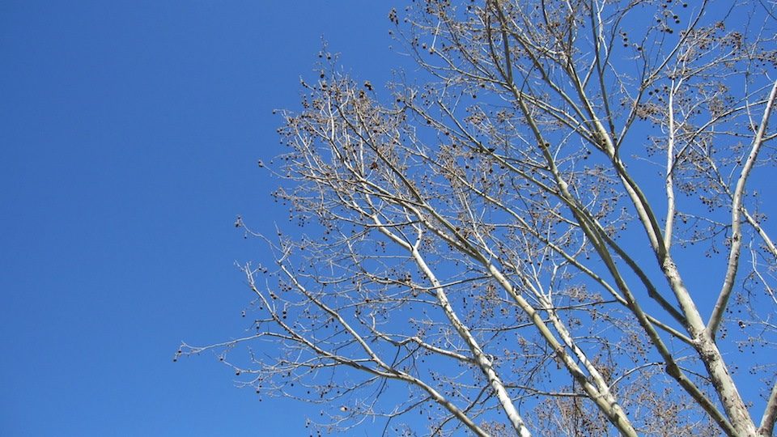
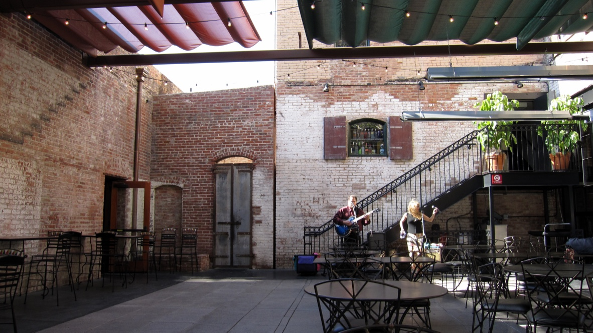
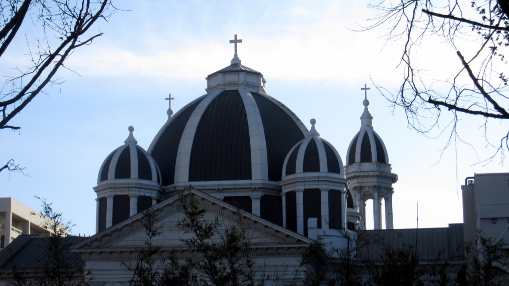
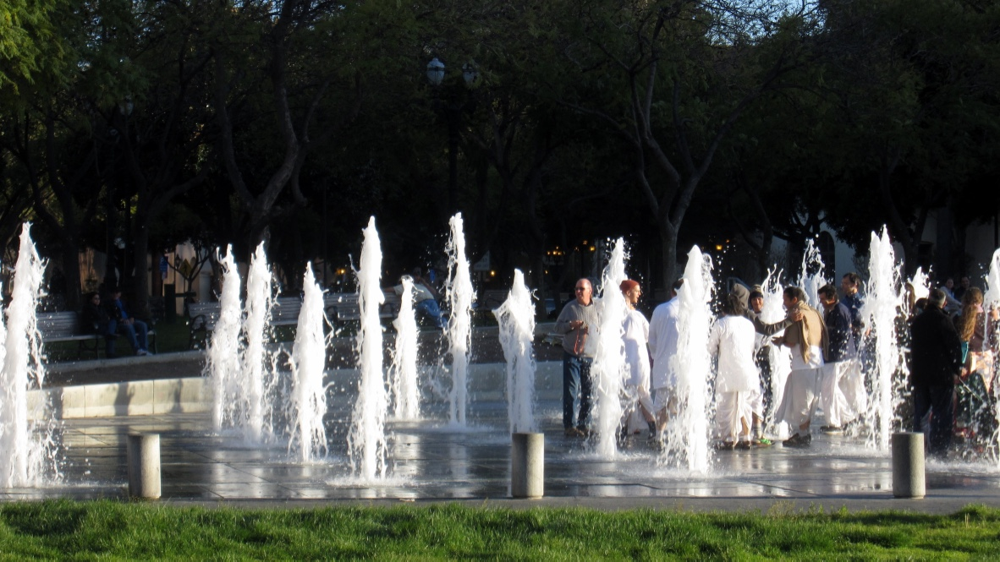
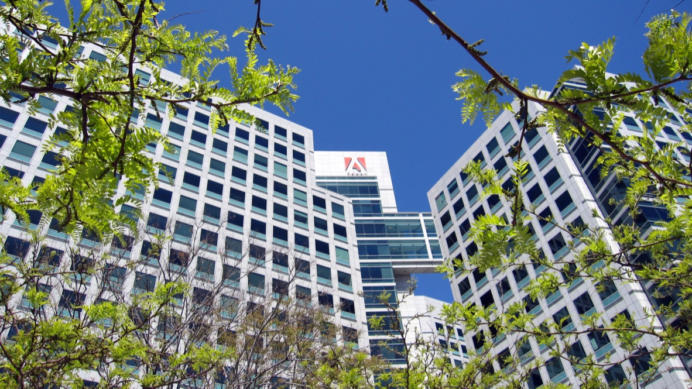
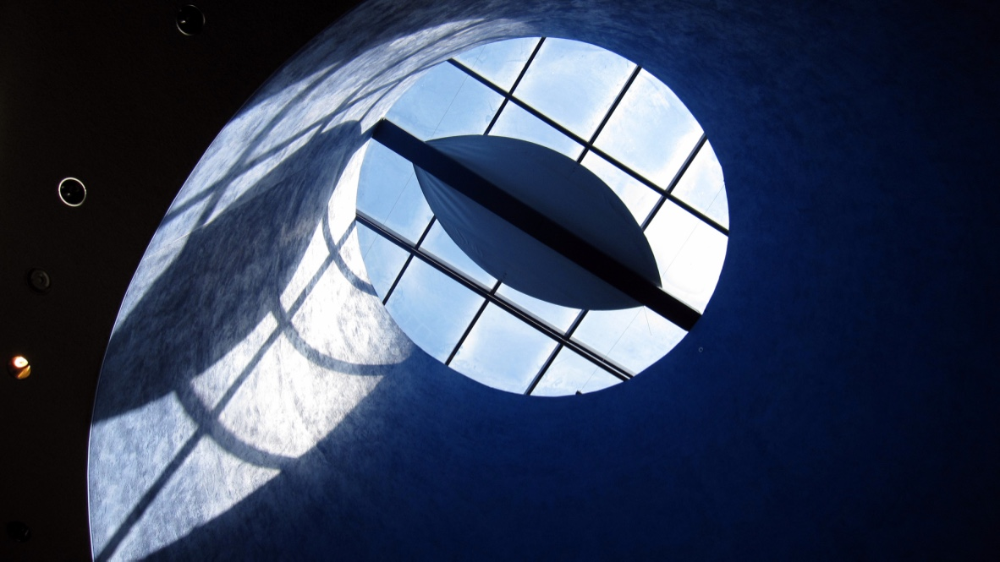
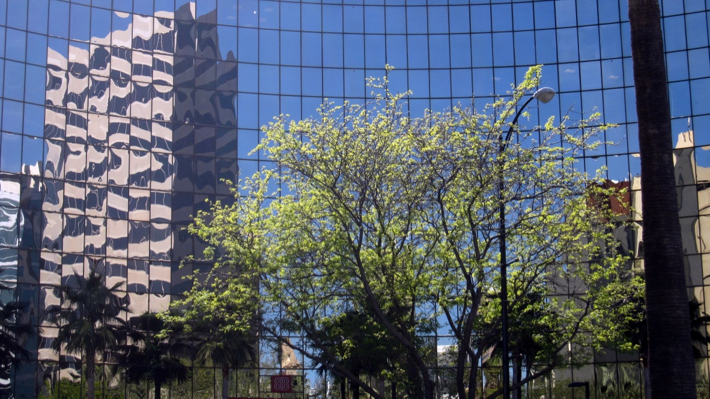

+++
title = "圣何塞"
description = ""
date = 2009-04-05
weight = 2
draft = false

sort_by = "date"
paginate_by = 5
paginate_path = "page"
insert_anchor_links = "none"
in_search_index = true

template = "section.html"
page_template = "page.html"
transparent = false

+++

2009年春季去硅谷做项目，住在坎贝尔县的 Pruneyard 的一家小旅馆，每日一大早去公司，很晚才回来，忙碌的很。

偶然看到旅馆楼下的一朵花煞是好看，就记录了下来

春天时光，路上的树叶子还没长出

终于周末，忙里偷闲去了圣何赛市区。上午就到了，吃惊的是 downtwon 原来竟这么安静，甚至有些冷清，只是到了下午快近傍晚，才见人气旺了起来。把有趣的事情记一下。

一家酒吧：有两个歌手在唱歌，下面只有我们三个听众，但他们还在认真表演。很喜欢他们歌的欢快节奏。

圣约瑟夫教堂：听四五个人在唱赞歌，“基督，如果你记得我……”，声音在教堂里回荡，让人可以感受到信仰的虔诚。有位美国大姐送我草叶一枝，大约是和复活节有关系，我不是特别听得懂她说什么。

圣何赛艺术博物馆：风景画别有风味；Jun Kaneko的陶瓷和绘画艺术既有东方的韵律，也有西式的抽象，煞是好看。我在博物馆里徘徊了好久，可惜不让拍照。

马丁路德金图书馆：问管理员是否可以进入，回答任何地方都可以去。这才叫公共图书馆！里面还有儿童活动室、旧书店。购得《美洲原始文化》和《贫穷与不公的经济学》。

印度人的仪式：不知道今天究竟是什么日子，只是见到一队印度人吹拉弹唱向广场走去，然后再到喷泉里去接受清凉之水的淋浴。不懂这究竟是什么含义。

Adobe的大楼：在树枝丛中找到一个缝隙，刚好把Adobe的大楼、Logo照下来。想到博士先生努力换作商业成功，也是美国社会奋斗成功的一例吧。

技术博物馆：展览主要面向儿童，教育为主。除了触摸式画布有点意思，其他世界各地都恐怕大同小异。可记的是电梯下楼的瞬间捕捉到天窗光影的组合，我自己觉得还有趣。

在市区转来转去，偶然记录下来几幅照片

