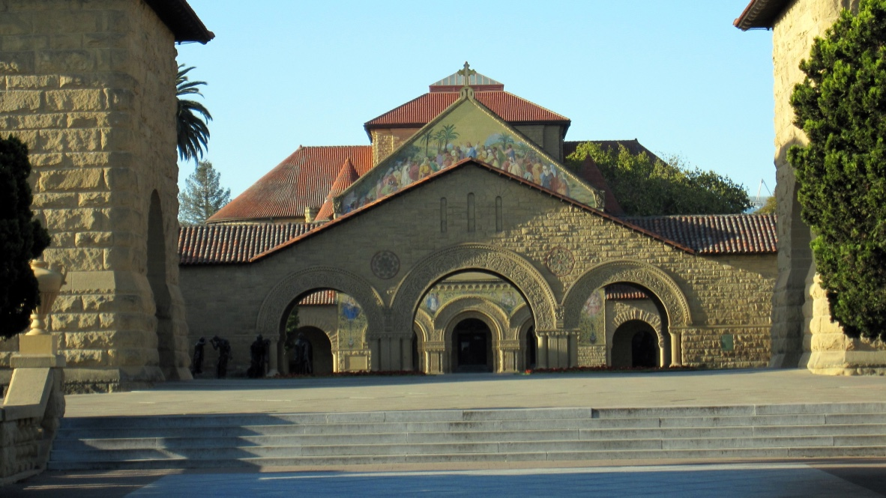

+++
title = "斯坦福"
description = ""
date = 2009-03-29
weight = 1
draft = false

sort_by = "date"
paginate_by = 5
paginate_path = "page"
insert_anchor_links = "none"
in_search_index = true

template = "section.html"
page_template = "page.html"
transparent = false

+++

2009年春季去硅谷做项目，周末坐公交去了 Palo Alto，镇里没有怎么转就走着去了斯坦福。

走了好久，才远远看到教堂。

正置学校放春假，校园里人非常少，在 Quad 拍到了走廊上的一串灯。

附近有罗丹的雕塑群，非常知名。也有艺术博物馆，另说。

但其实还有很多其他艺术家的雕塑，比如下面这个，如果没记错是 Henry Moore 的作品。

临走前购得 John Barrow 的天文学科普读物 Theories of Everything 。
