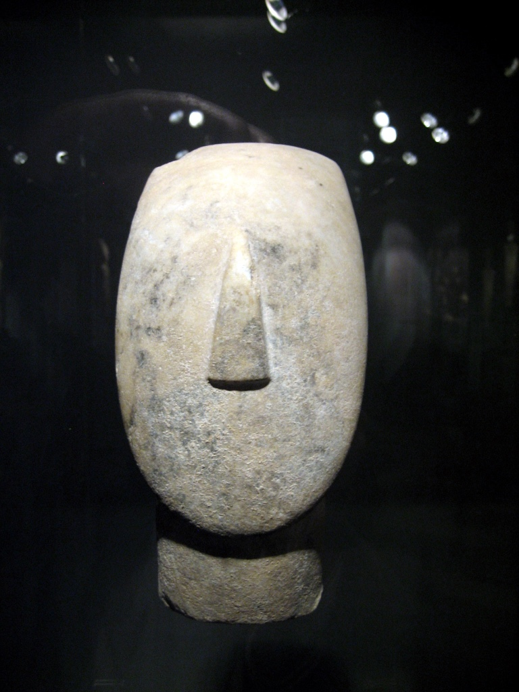
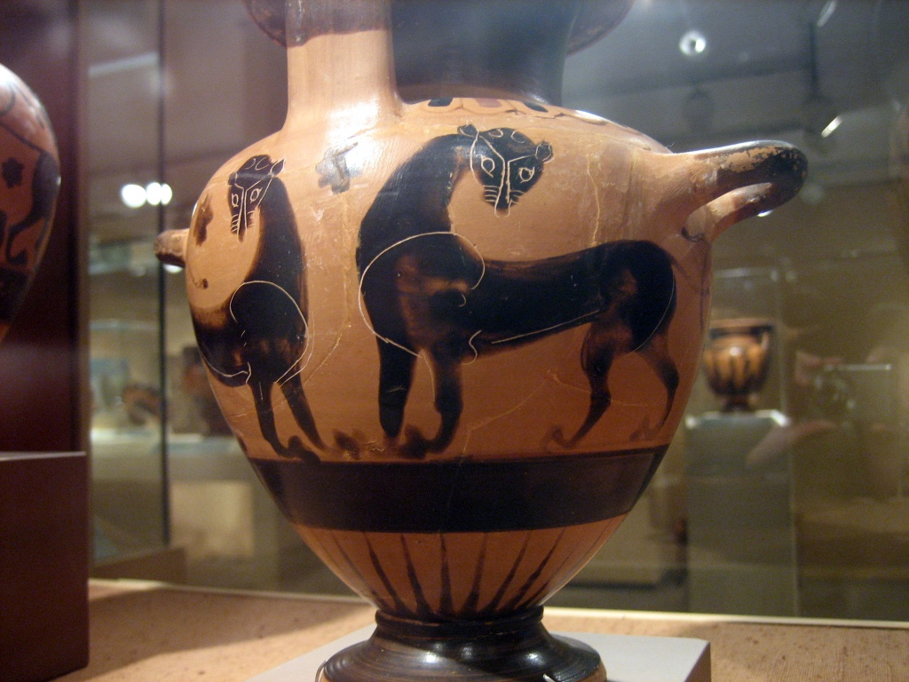
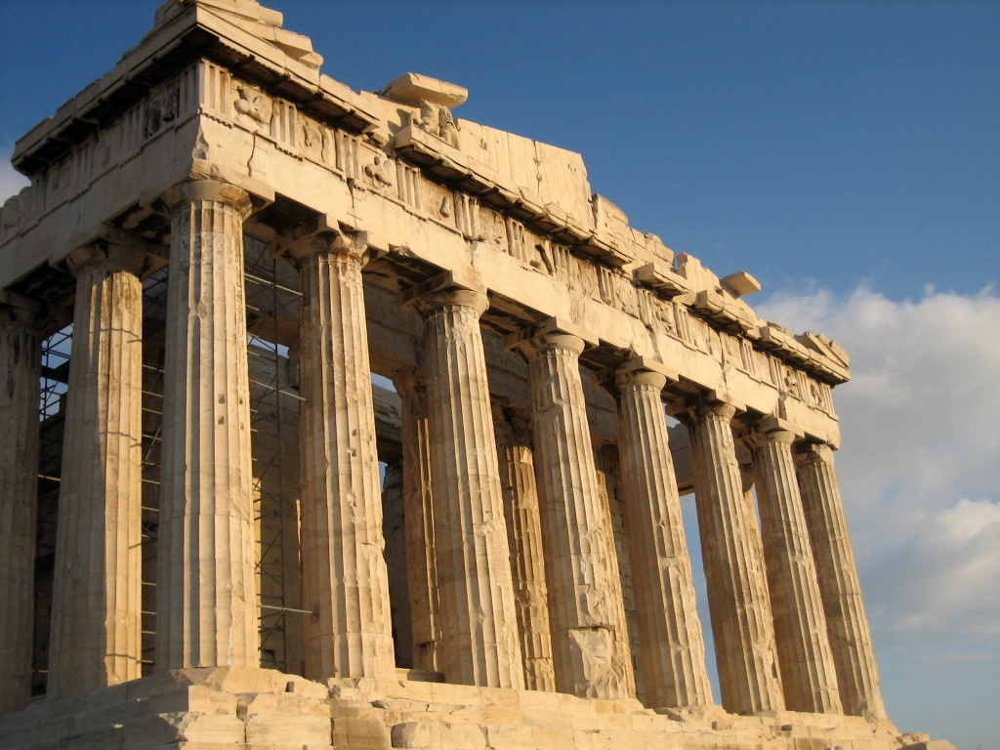
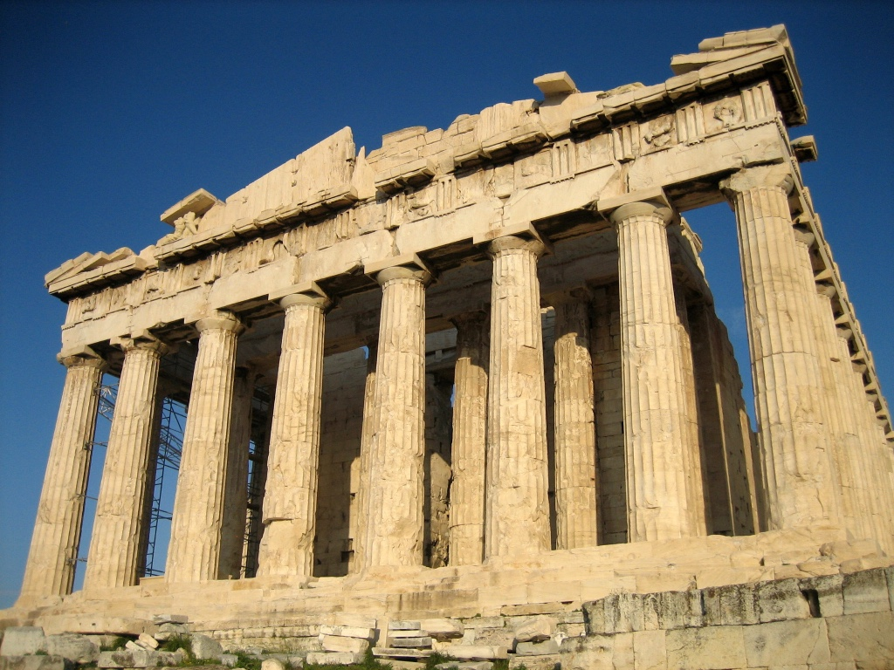
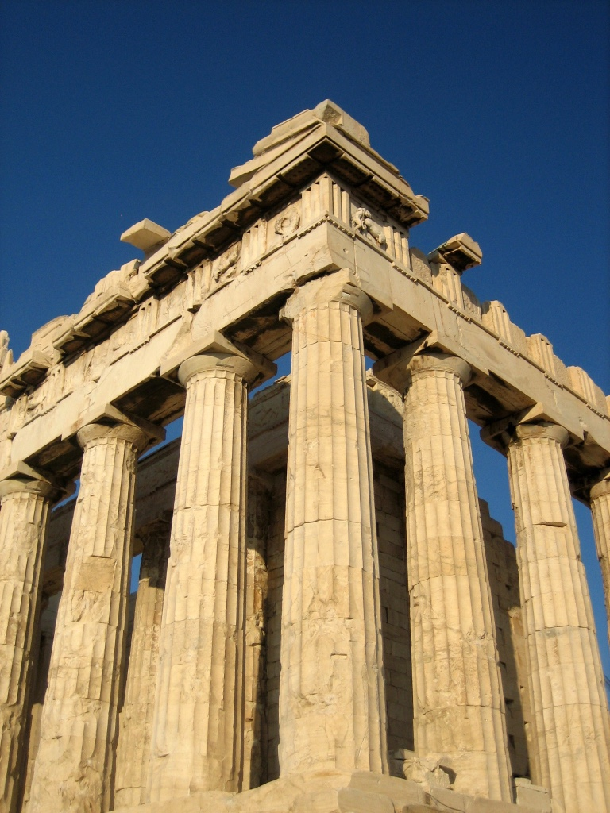
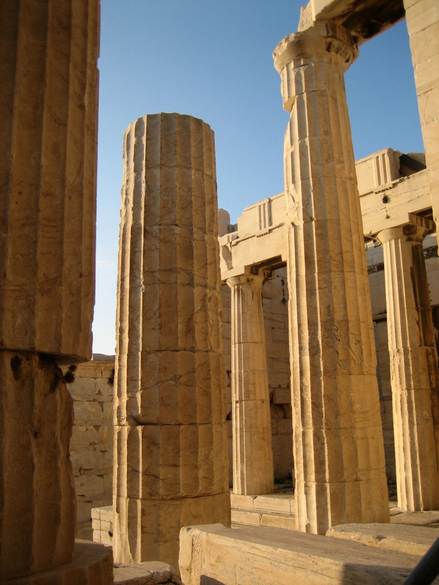
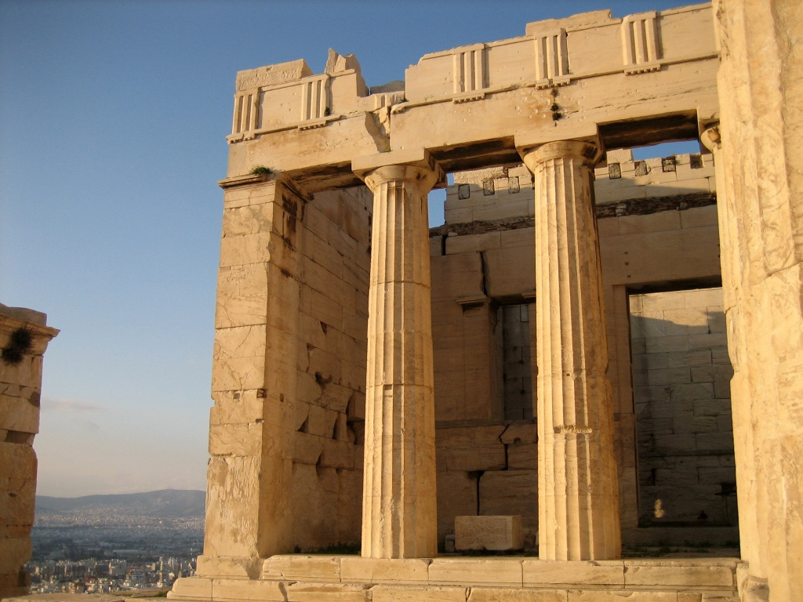
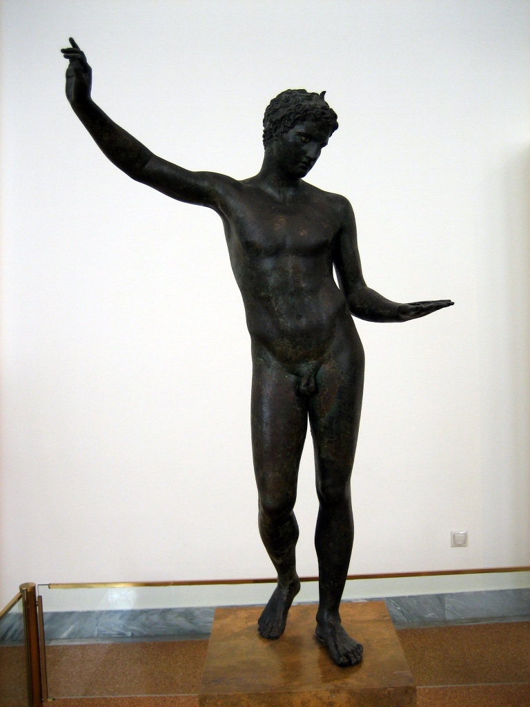
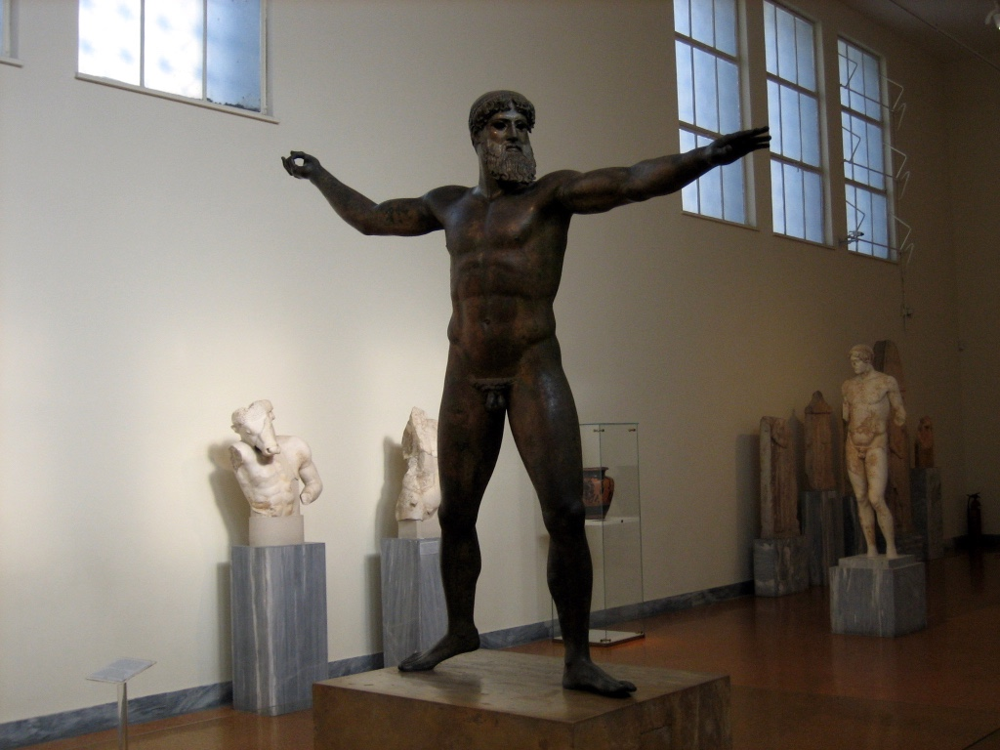

+++
title = "雅典的遗迹与博物馆"
description = ""
date = 2018-09-11
weight = 1
draft = false

sort_by = "date"
paginate_by = 5
paginate_path = "page"
insert_anchor_links = "none"
in_search_index = true

template = "section.html"
page_template = "page.html"
transparent = false

+++

2006 年，第一次出国，去雅典做项目，平日在客户处，只能周末出去。
依稀记得，走下缪斯小山，前面是热闹的街市，回望则是日暮中的卫城。
如果几千年前中国青铜器胜在那种充满想象的瑰丽纹饰，那么他们希腊同行的青铜人像则是另一种美，
我们能感觉到那种感性与理性的精巧平衡。还有那没有表情的基克拉泽斯文化的大脸，怎么也抹不去的记忆。

