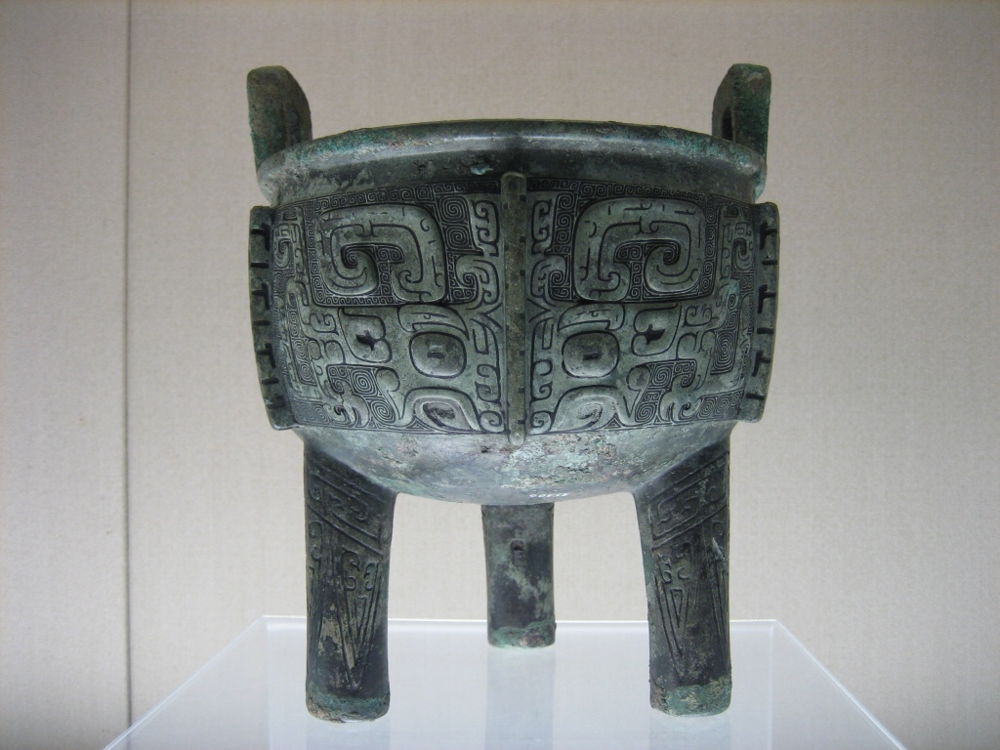
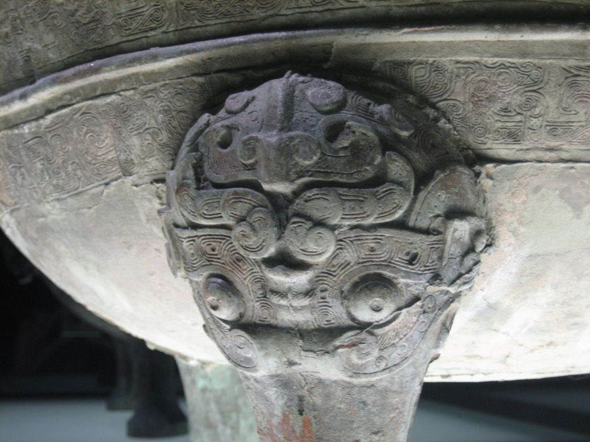
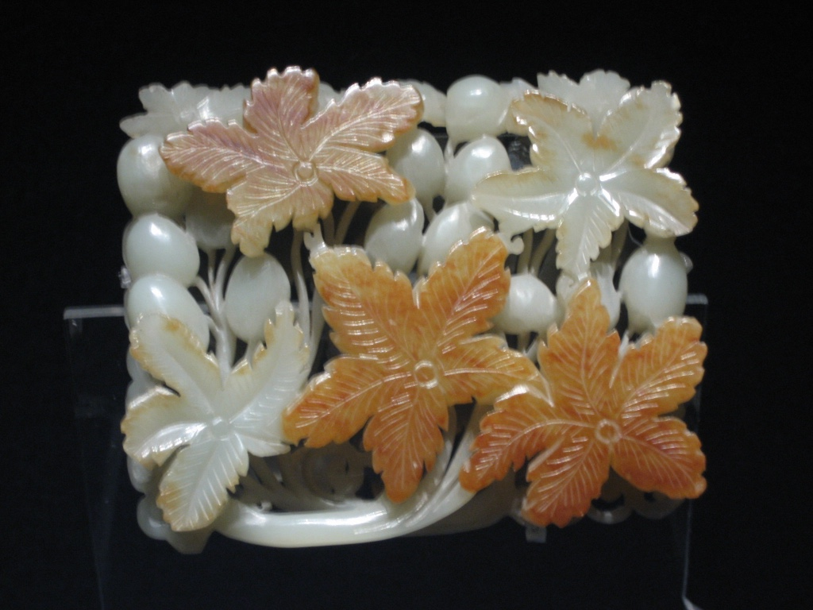
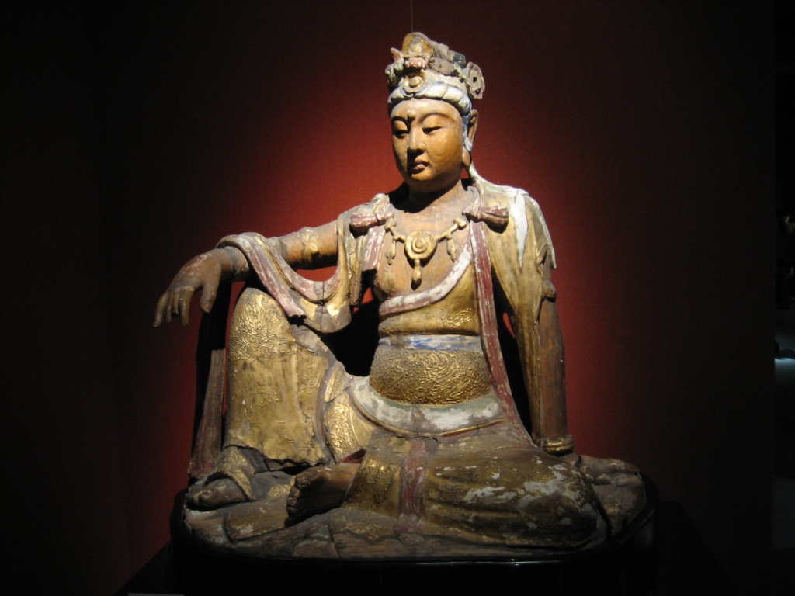
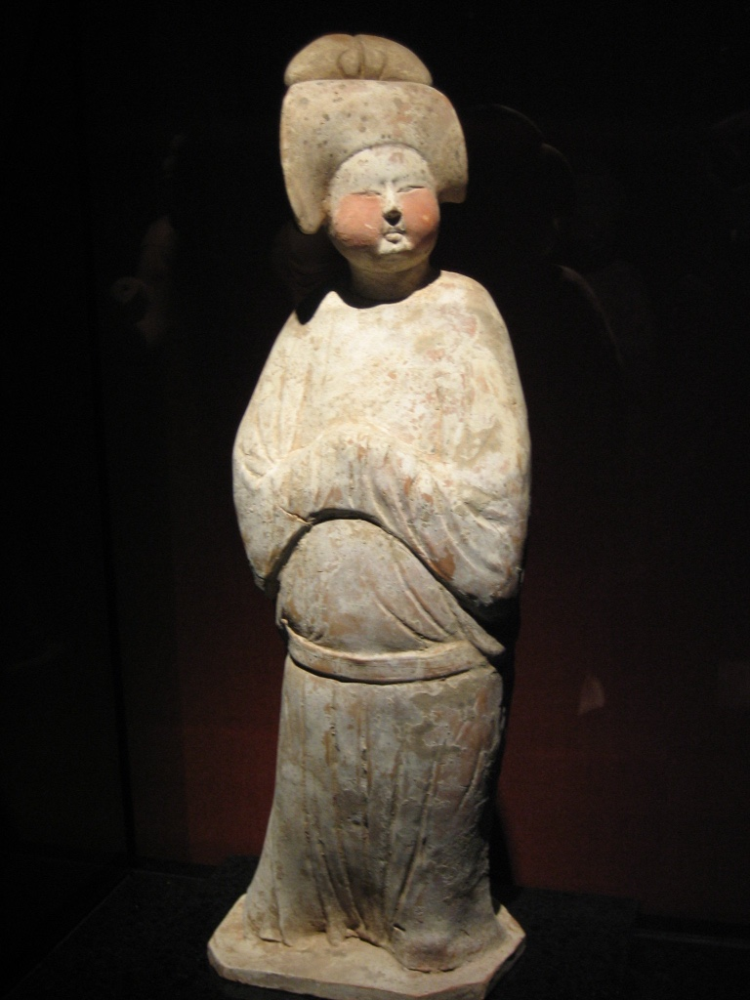

+++
title = "上海博物馆"
description = ""
weight = 1
draft = false

sort_by = "date"
paginate_by = 5
paginate_path = "page"
insert_anchor_links = "none"
in_search_index = true

template = "section.html"
page_template = "page.html"
transparent = false

[extra]
date = 2018-09-11

+++

2005 年初到上海，就被上海博物馆里的各种展品迷住了，几年间估计得去了不下二十趟。
对[青铜器](/technology/bronze/)的学习也是那时候开始的。

