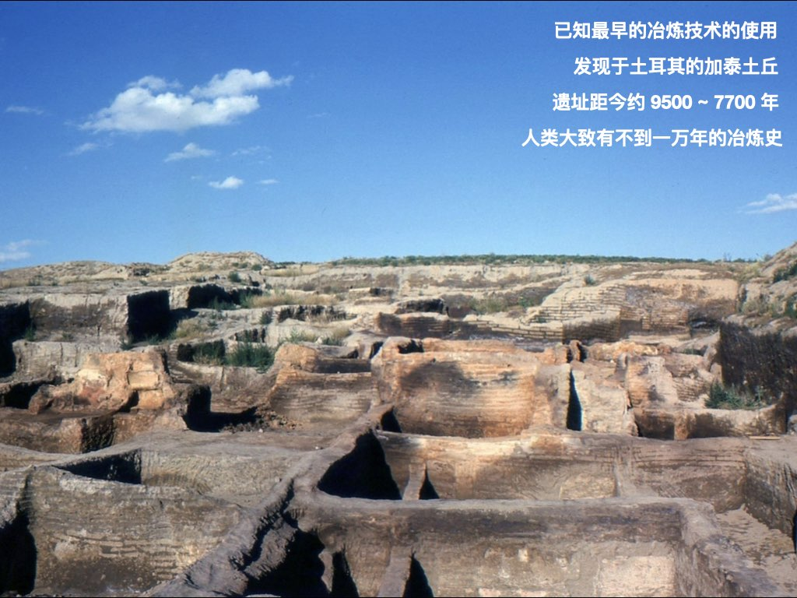
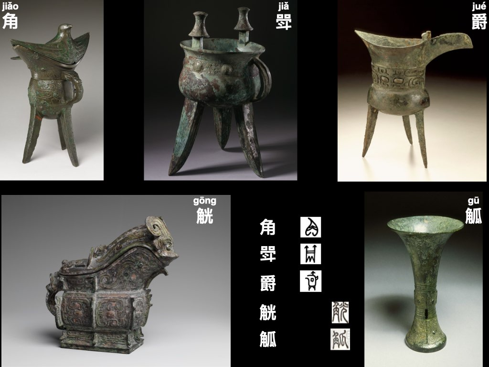
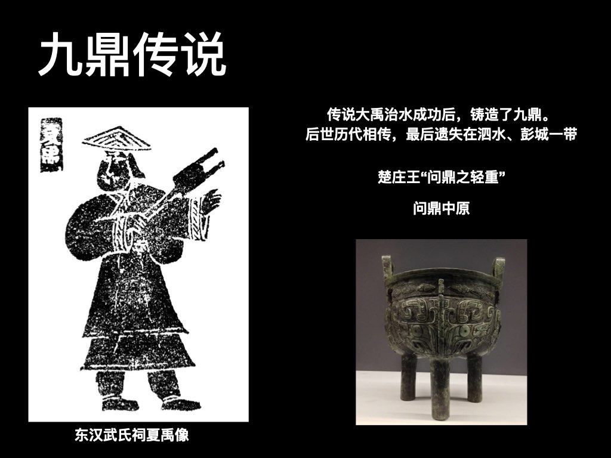
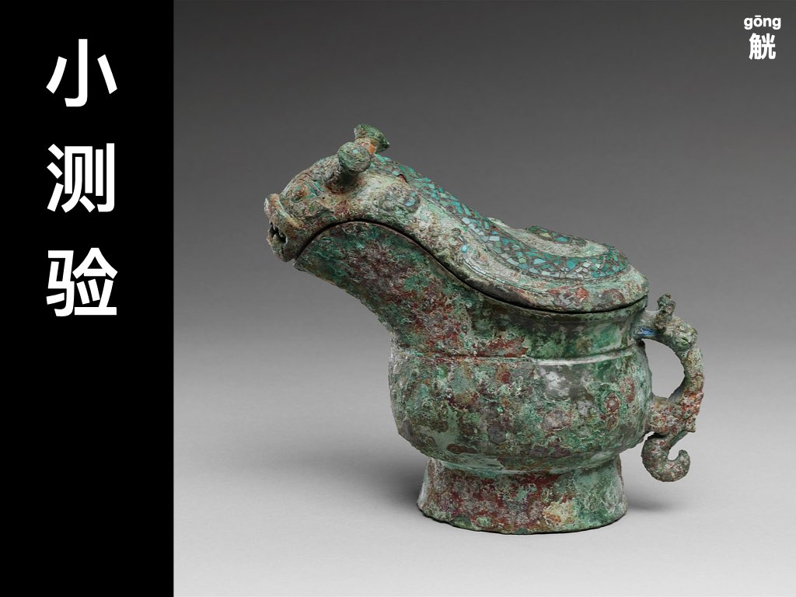

+++
title = "中国古代青铜器"
description = ""
weight = 0
draft = false

sort_by = "date"
paginate_by = 5
paginate_path = "page"
insert_anchor_links = "none"
in_search_index = true

template = "section.html"
page_template = "page.html"
transparent = false

[extra]
date = 2018-09-11

+++

[下载讲稿](bronze.pdf)

诗人李白曾感叹道：“夫天地者，万物之逆旅也；光阴者，百代之过客也。”时间川流不息，人类的文明薪火相传。

已知最早的冶炼技术的使用，发现于土耳其的加泰土丘，遗址距今约 9500 ~ 7700 年，人类大致有不到一万年的冶炼史。流动的金属凝固成永恒的美，记录了世界各地的文明发展，我们将要打开的是关于华夏一族的故事。

## 零、引子

时间川流不息，人类的文明薪火相传。

已知最早的冶炼技术的使用，发现于土耳其的加泰土丘，遗址距今约 9500 ~ 7700 年，人类大致有不到一万年的冶炼史。

流动的金属凝固成永恒的美，记录了世界各地的文明发展，我们将要打开的是关于华夏一族的故事。

想象游戏：体会历史的悠久
* 如果我们班每一个人是一代人的历史（10年）
* 我们全班同学排成队，大约是一个大朝代的历史（400年）
* 我们全年级同学排成队，大约是中华文明的历史（5000年）
* 我们一二三年级同学排成队，比人类文明史稍长一点（15000年 vs 12000年）
* 我们全学校同学排成队，只是人类历史的一小部分（30000年 vs 300000年）
* 每一代人都有他们的故事

我们要讲的故事横跨夏、商、周与秦、汉。

国之重器—中国古代青铜器

目录：
在中国大陆的小学一年级语文课本上，最初的几页有一首识字歌，刚好配成本次分享涵盖的范围

* 一二三四五：惊鸿之一瞥
* 金木水火土：青铜器的铸造
* 天地分上下：礼乐的制度
* 日月照今古：永存于世的美

## 一、惊鸿之一瞥

角斝爵觥觚

鼎

簋豆鬲甗盉

尊卣壶

尊：牺尊、鸮尊、象尊

镈钟

符钺戈剑

异彩纷呈：蜀、滇

小测试：读拼音

## 二、青铜器的铸造

大自然的馈赠与人类智慧的结晶
* 铜矿石
* 铅矿石
* 锡矿石

青铜的熔点比纯铜的低，但硬度更高

陶范法

失蜡法

## 三、礼乐故事

九鼎的传说：传说大禹治水成功后，铸造了九鼎。后世历代相传，最后遗失在泗水、彭城一带。楚庄王曾问鼎之轻重，故有“问鼎中原”的成语。

尊卑有序，列鼎制度是一个体现
* 天子：九鼎
* 诸侯：七鼎
* 卿、大夫：五鼎
* 士：三鼎或一鼎

成语：一言九鼎

* 文王被拘羑里而演周易
* 武王伐纣：牧野之战
* 利簋铭文的记载：珷征商隹甲子朝歲……
* 天命与忧患的思考

* 商代的蟠龙纹盘
* 汤之《盘铭》曰：苟日新，日日新，又日新
* 《诗经-大雅-文王》：周虽旧邦，其命维新

* 吴公子季札访鲁
* 评卫风有：美哉，渊乎，忧而不困者也。
* 今人有学者庞朴作“忧乐圆融”一说

* 《诗经-卫风-凯风》：
* 凯风自南，吹彼棘心。棘心夭夭，母氏劬劳。
* 凯风自南，吹彼棘薪。母氏圣善，我无令人。
* 爰有寒泉？在浚之下。有子七人，母氏劳苦。
* 睍睆黄鸟，载好其音。有子七人，莫慰母心。

## 四、永存于世的美

* 龙纹
* 兽面纹

兽面纹详解

凤鸟纹

拙朴而高古

瑰奇的想象

细腻与简洁

匀称与夸张

残缺与饱满

理性之光

## 五：回顾

* 贡献：大量精美青铜器是古代中国文明对世界的独特贡献
* 分类：各种类别的青铜器
* 铸造术：陶范法与失蜡法
* 礼制：古代中国维系社会的重要方式
* 美：纹饰、器型……

## 刘：小测试

这是什么器物？

这是什么器物？

这是什么纹饰？

这是什么纹饰？

结合今天的讲解，试着讲一下庞朴的忧乐圆融

