+++
title = "好奇心、AI与教育"
description = ""
date =2020-05-18
weight = 0
draft = false

sort_by = "date"
paginate_by = 5
paginate_path = "page"
insert_anchor_links = "none"
in_search_index = true

template = "section.html"
page_template = "page.html"
transparent = false

+++

[下载](/downloads/curiosity.pdf)：这是一篇插图与意象俱佳的演示文档，写作目的一是参加好奇心大会，二是想消除我自己内心的困惑。
当时对AI发展的一些估计，在两年后已经逐步变成了《自然》杂志的文章了，飞速发展的世界！动荡不定的世界！

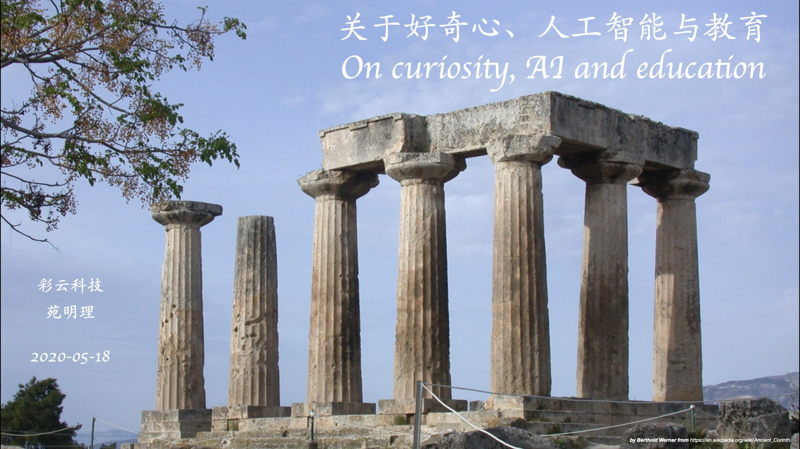

第一部分：好奇心

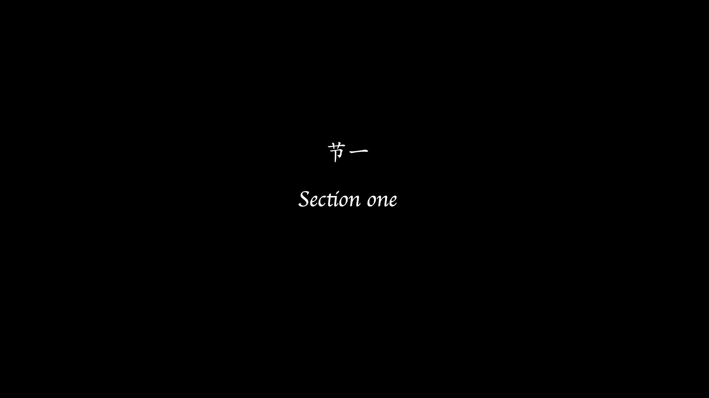

几百年来，中国人系统地译介西文著作进入中文世界，可谓汗牛充栋。

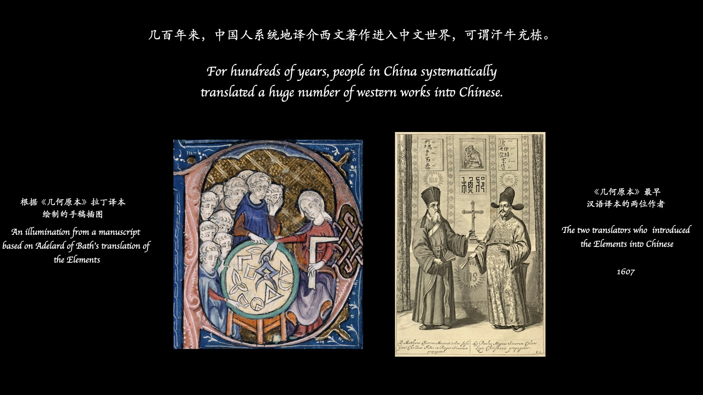

这本斯蒂芬·茨威格的回忆录《昨日世界》仅仅是其中的一本—逝去的世界的另一面是动荡不定的时代。

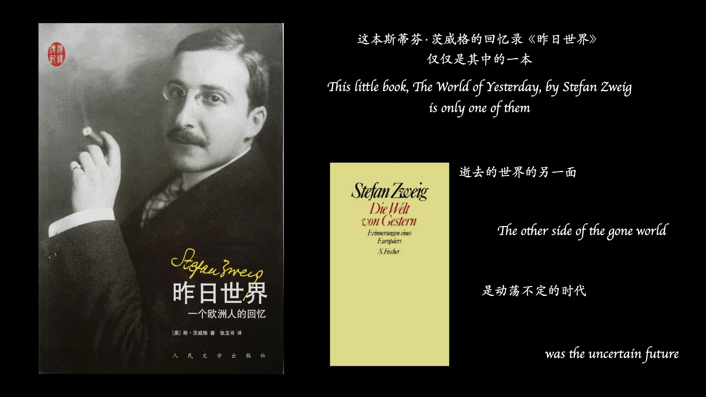

然而即便在战火纷飞的年代，亚瑟·爱丁顿仍然把德语的相对论介绍到英语世界。

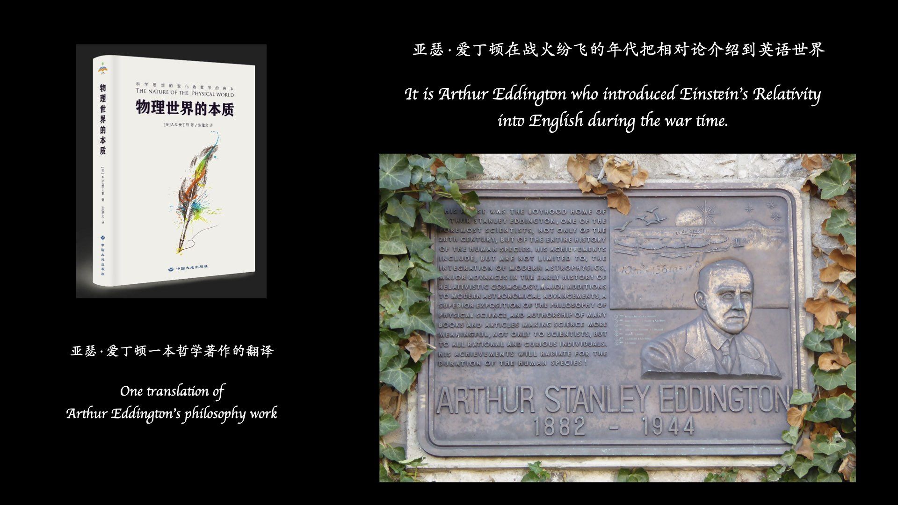

回顾当时的历史，看一看那些把人类带到下一个阶段的种子都藏在哪里？

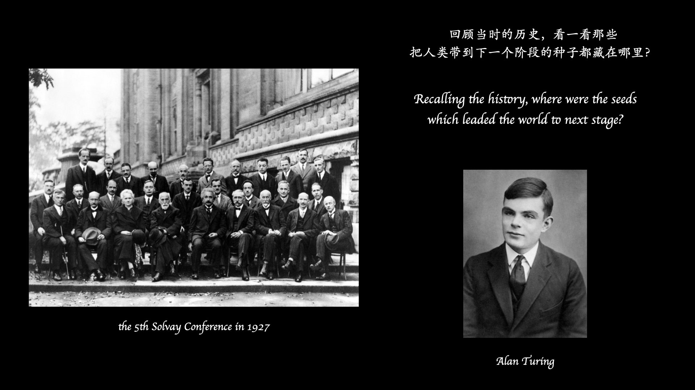

我们在大自然面前永恒的有限，和发自我们心底无尽的好奇。

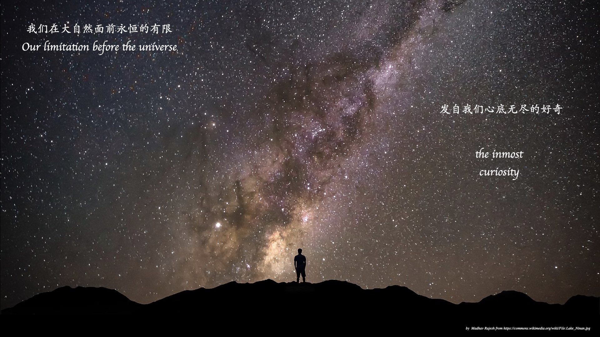

第二部分：人工智能

AI 的广泛应用正在发生，未来最可期待的是什么？

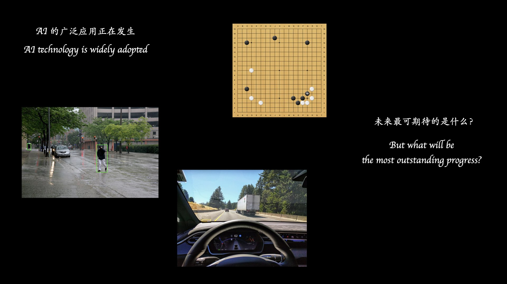

蛋白质折叠? 气候模型? 它们都是困难、基础和重要的。

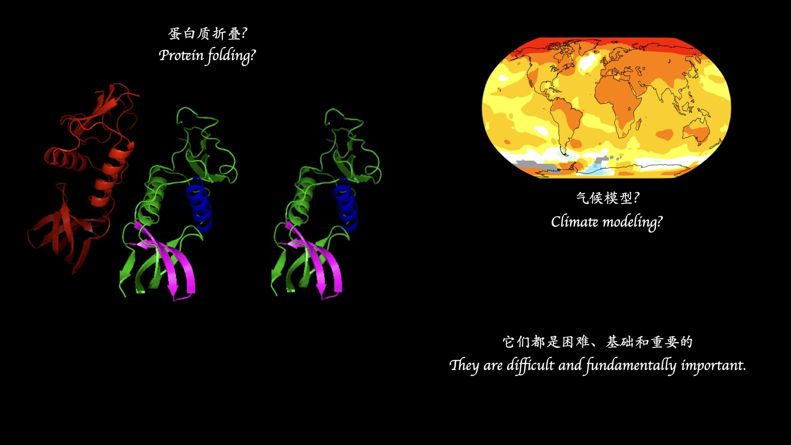

大自然有无穷无尽的未知模式与规律。

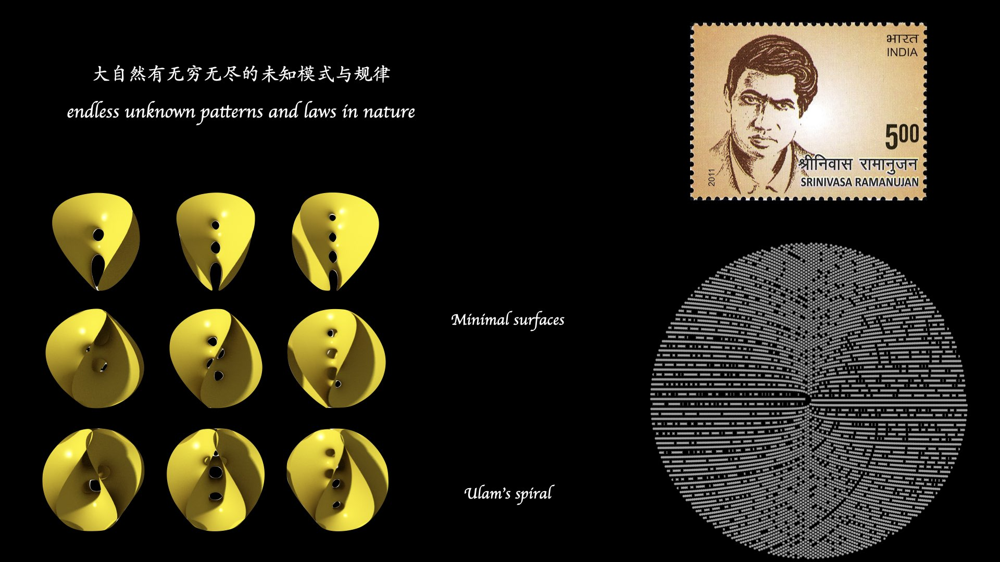

只有深深地向下走才能给我们带来观念的突破。

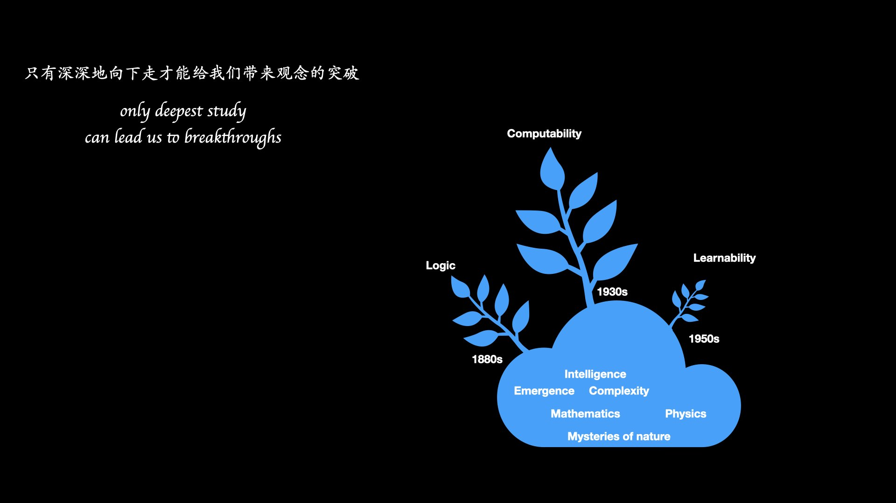

第三部分：教育

正在消融的冰川……

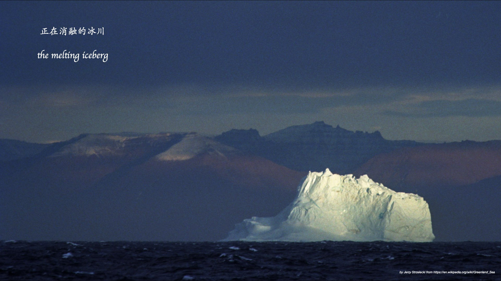

贫苦的悲怆之情……

正在发生的知识边界上的突破……

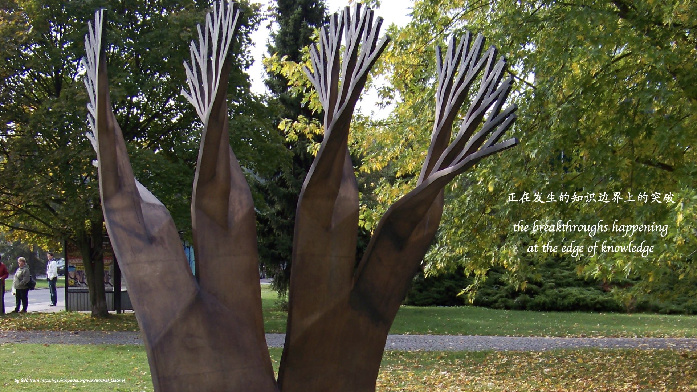

在所有意象的回响之中，我们发现好奇心、同理心、诚实和责任，会给到我们一个坚实的未来！

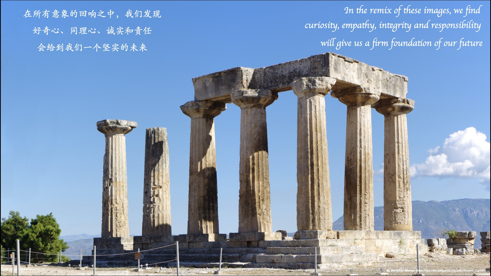

谢谢！

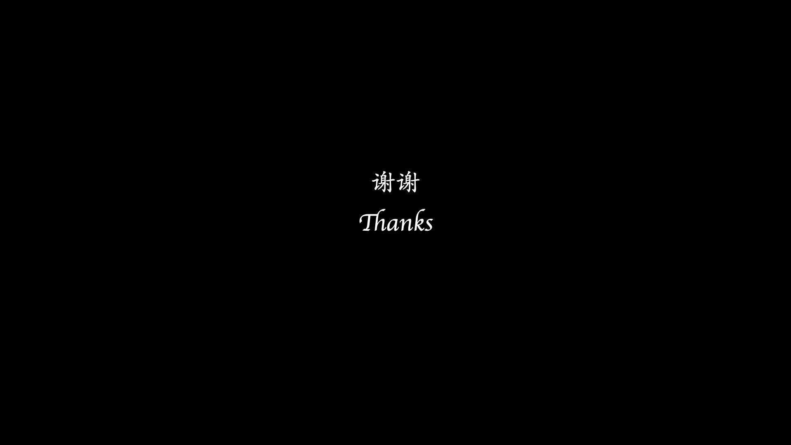

作者介绍

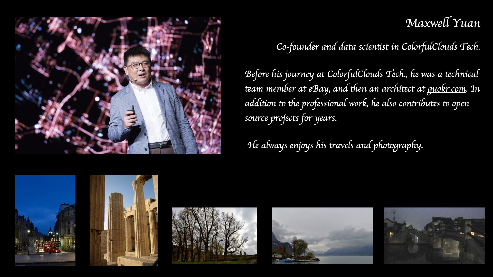

