+++
title = "维基"
description = ""
date = 2012-10-11
weight = 0
draft = false

sort_by = "date"
paginate_by = 5
paginate_path = "page"
insert_anchor_links = "none"
in_search_index = true

template = "section.html"
page_template = "page.html"
transparent = false

+++

[下载](/downloads/wiki.pdf)：这个演示文档简单介绍了笔者理解的维基百科，给出了维基技术的历史和一些原理性的思考。

---

封面

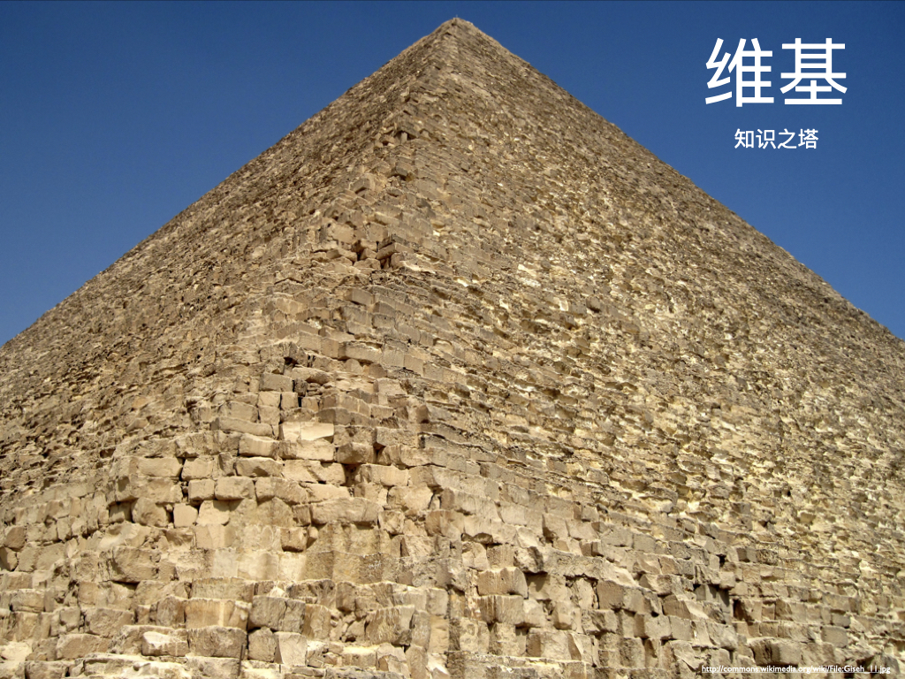

目录

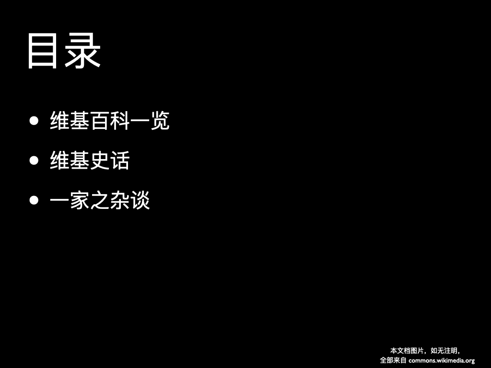

第一节：维基百科一览

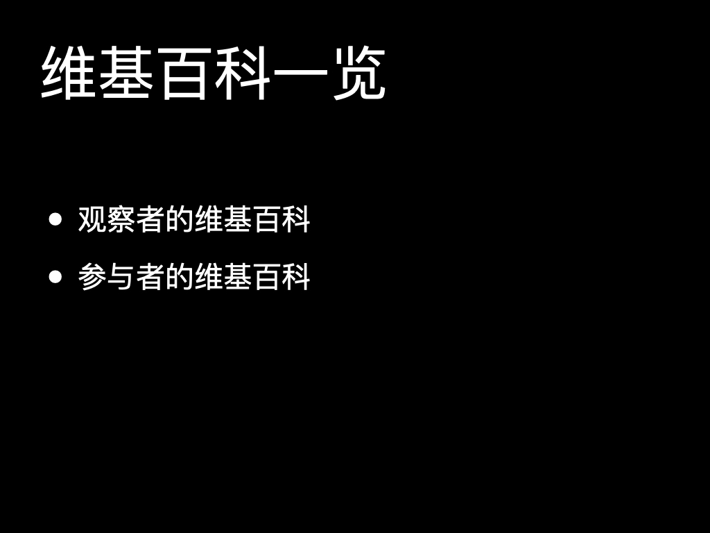

1948年建筑学家勒·柯布⻄耶在他的代表作《模度》一书中写道

> 生活对于人类来说说不是百科全书，她是个性化的……在生活面前，有些人不能无动于衷，相反，他们是生活的积极参与者......
> 因为在这里，一个人、一方⻛土、一种氛围、一份热情、一种局势、一些状况、一个机会，
> 它们构成一个历经纷繁生活环境的规律序列：局势，热情，矛盾，竞争，
> 一些事物的衰退，一些事物的兴起，一些特殊的条件，经历的变革……
> 而在图书馆的书架对面，百科全书在那儿，那些卷轴静静的排成行。

在他和当时的理解里，生活有观察者和参与者的区别，人们认为写百科全书的人，更多是生活的观察者。2012 年人们认为维基百科是大众智慧通过互联网放大后的结晶。
那么勒·柯布⻄耶的观点还成立吗？

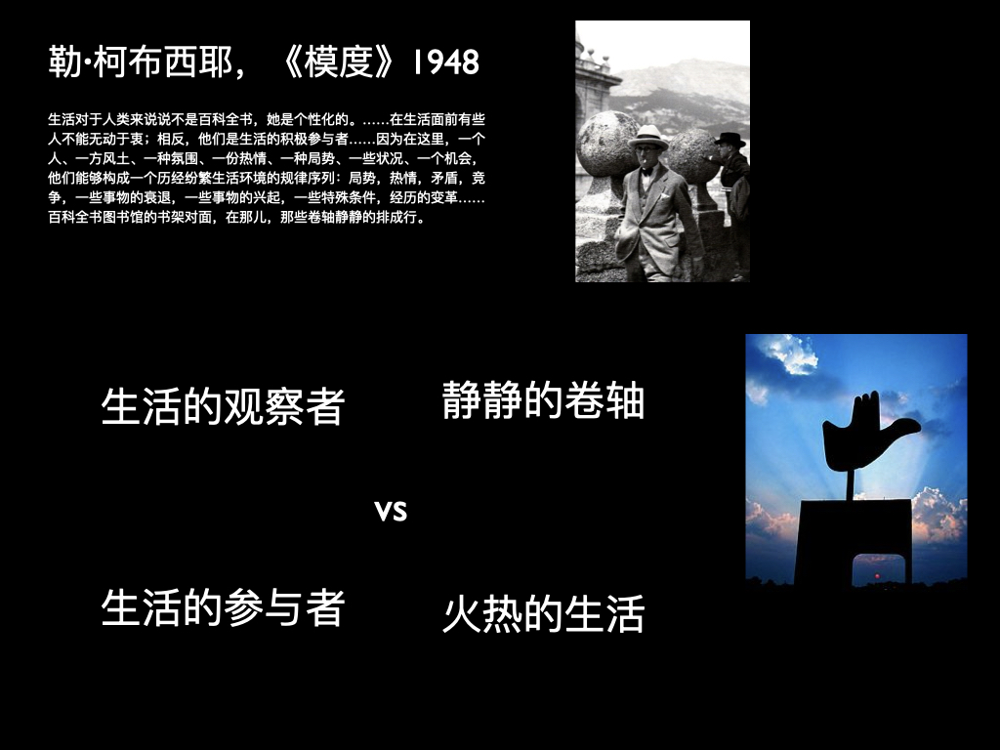

维基静静的卷轴，既容纳了冷峻的观察，也囊括了火热的参与。
让我们通过特色条目来看一看今日百科的情形。

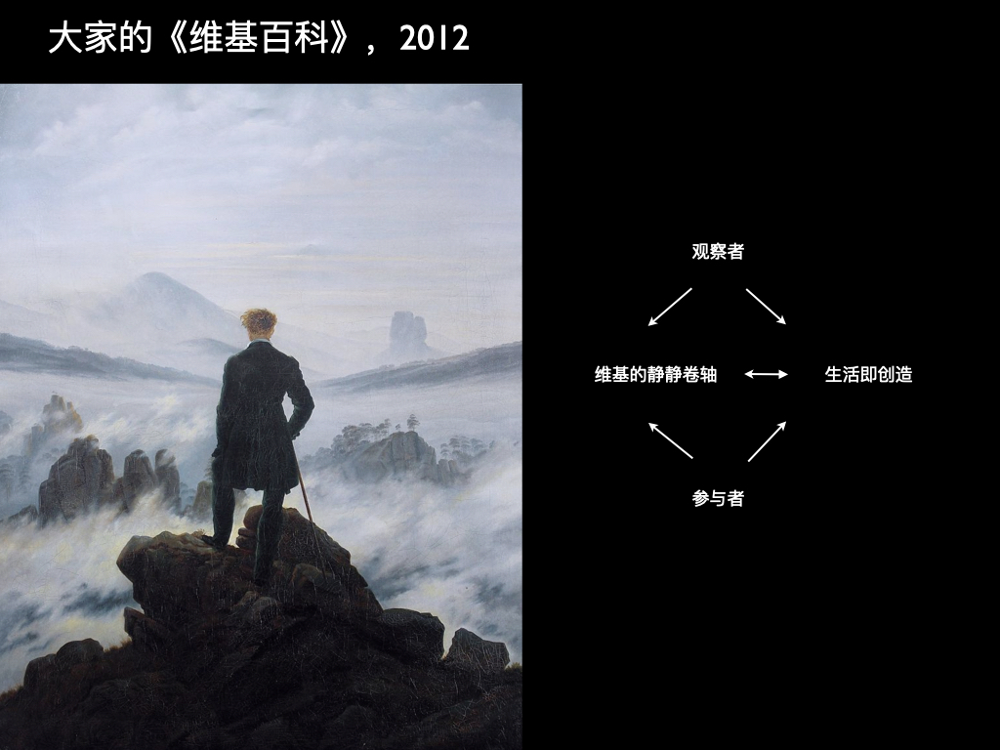

在中文百科的特色条目中，我们找得到各个尺度上的自然现象和科学史的详尽发展。这是一种"真"的体现。

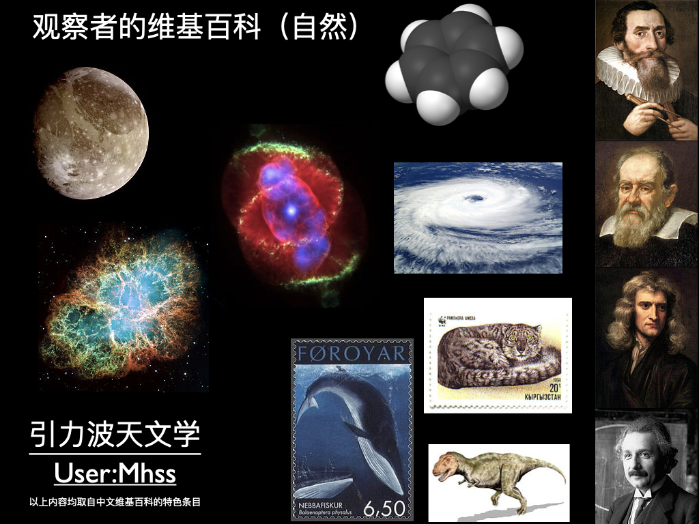

也有对历史种种细节的记载，这是另外一种人文的"真"的体现。

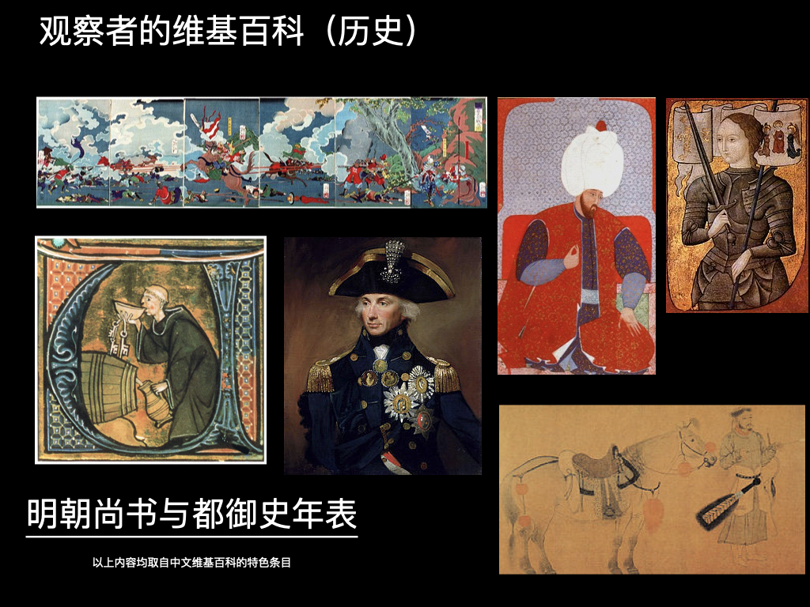

更能感受到"美"的力量。"真"和"美"都是我们观察到的世界的一部分。

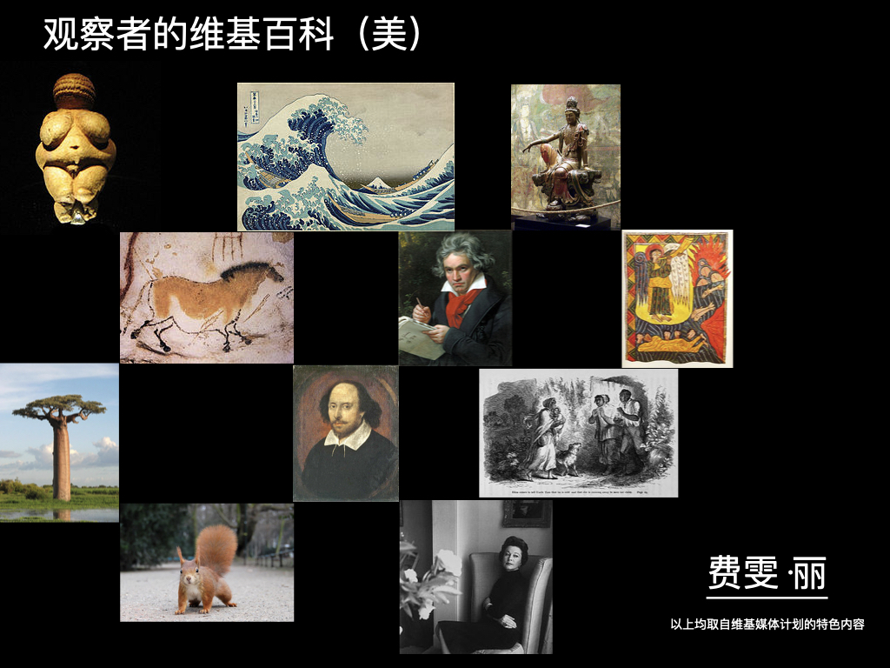

种种的社会热点回应了"参与者百科"的观点。

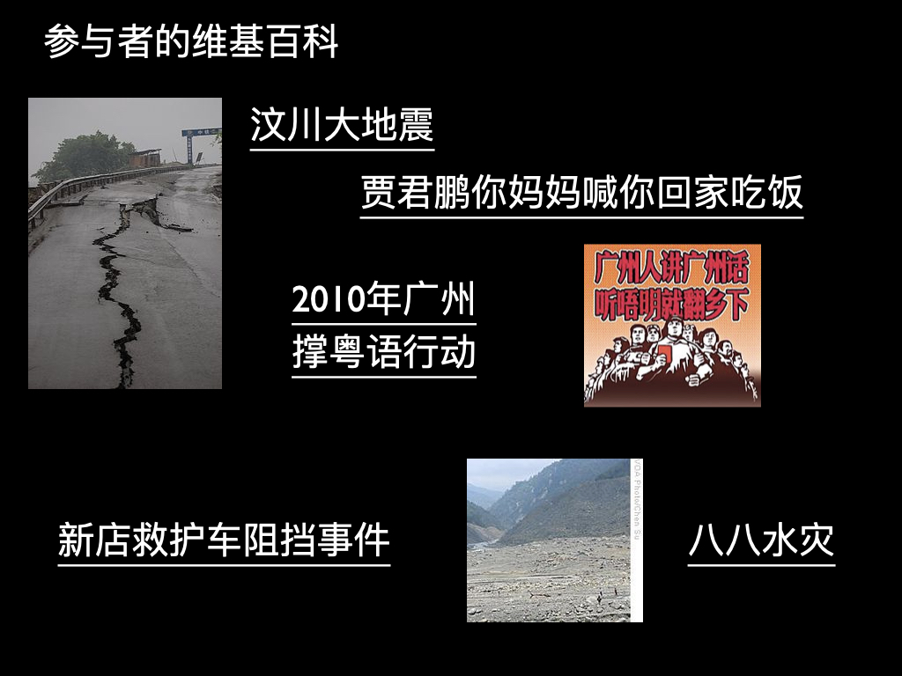

而你我心爱的城市也是"参与者百科"的体现。

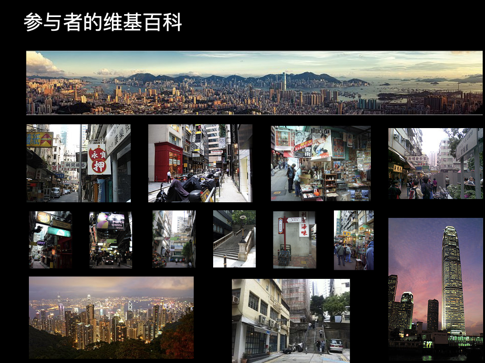

维基像一个巨大的熔炉把人类的知识熔铸为一体。

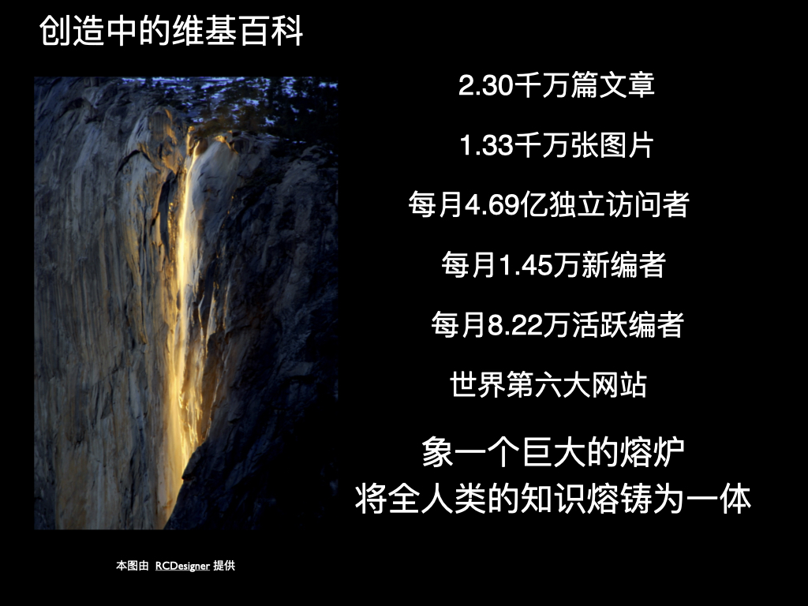

第二节：维基史话

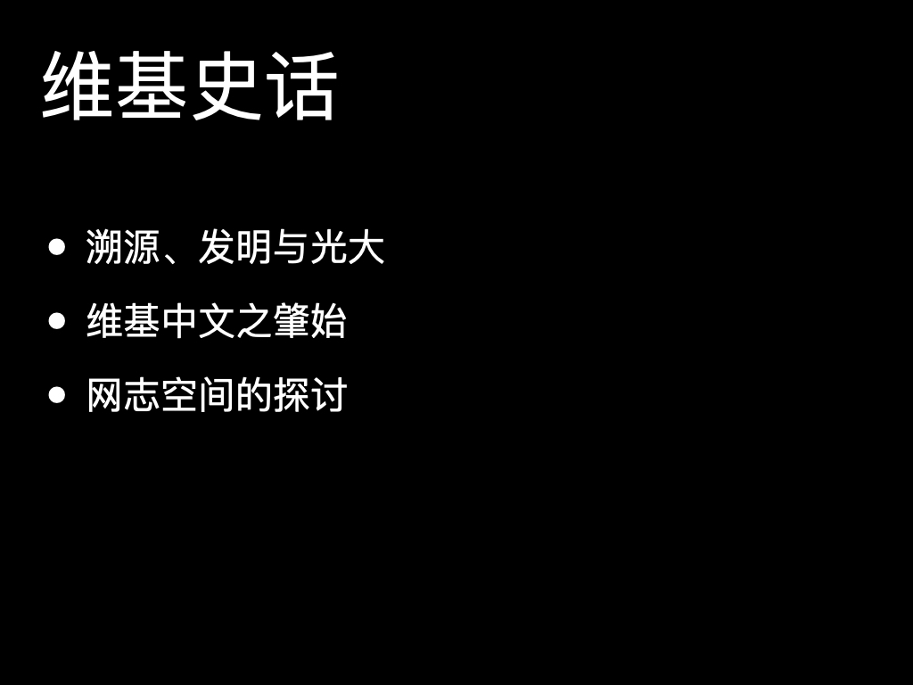

追根溯源，事情需要从建筑学家 Christopher Alexander 谈起，他是设计模式的提出者。在1960、1970年代，他提出了一系列的观点。
以《俄勒冈实验》这本书为例，他提出了建筑和社区共同成长的六个原则：有机秩序、参与、分片式发展、模式、诊断和协调。
这六个原则中有机秩序是目的和总纲，其他的几项是方法。他希望创造出一种机制，可以让建筑和社区共同地、缓慢地、自底向上、自发地生长。
模式就是总结交流社区本地经验的一种方法，服务于这个大的目标。整个想法，都是从社区如何自我组织、自我规划的角度来立论的。
这些思想深深地扎根在 Wiki 的软件设计和社群组织上，使得 Wiki 是一种有自己哲学的软件形式和社群形态。

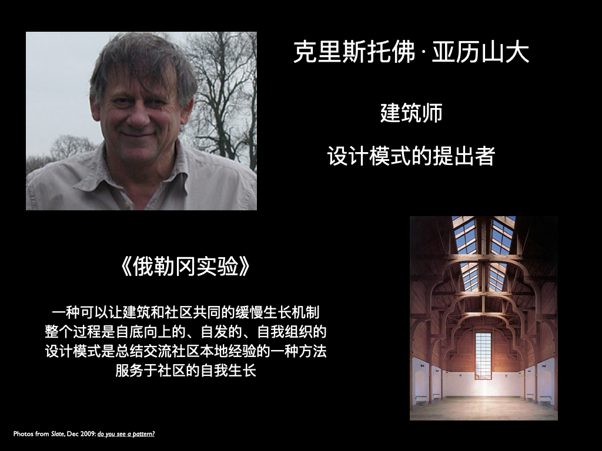

Wiki 技术与概念诞生于万维网发展的早期，我们需要从生活在美国俄勒冈州的 Ward Cunningham 说起。
1987年9月，来自 Apple 公司的 Kent Beck 和 Ward 一起撰写了论文《为面向对象程序使用模式语言》（Using Pattern Languages for Object-Oriented Programs），
并在该年的 OOPSLA 会议上发表。此后，Ward 一直活跃在编程的模式社区里。1991 年 11 月，Ward 和妻子 Karen 利用他们的专业技能，
创立咨询公司 Cunningham & Cunningham，1994年10月注册了域名 c2.com，并且开始建立一个在线的模式资料库 PPR（Portland Pattern Repository）。
参与 OOPSLA 和 PLoP 会议的一些研究人员开始通过 email 参与 PPR 的建设。

1994年，Ward 用 Perl 为 PPR 开发一个补充性质的工具 WikiWikiWeb。它作为一种协作式的数据库，使得大家可以快速、直接撰写页面。
而 WikiWiki 本身就是夏威夷语“快点、快点”的意思。1995 年 3 月 16 日，Ward给他的伙伴发了一封信，写到：

> Steve -- I've put up a new database on my web server and I'd like you to take a look. It's a web of people, 
> projects and patterns accessed through a cgi-bin script. It has a forms based authoring capability that doesn't require
> familiarity with html. I'd be very pleased if you would get on and at least enter your name in RecentVisitors. 
> I'm asking you because I think you might also add some interesting content. 
> I'm going to advertise this a little more widely in a week or so. The URL is http://c2.com/cgi-bin/wiki. 
> Thanks and best regards. – Ward

3 月 25 日作为 WikiWikiWeb 正式开张。5 月 1 日，Ward 发信给模式社区的邮件列表，邀请大家一起参与使用 WikiWikiWeb 这种新的工具。
由于当时万维网还是非常新奇的事物，加之参与者的素质比较高，WikiWikiWeb 在模式社区迅速走红。这就是 Wiki 的发明过程。

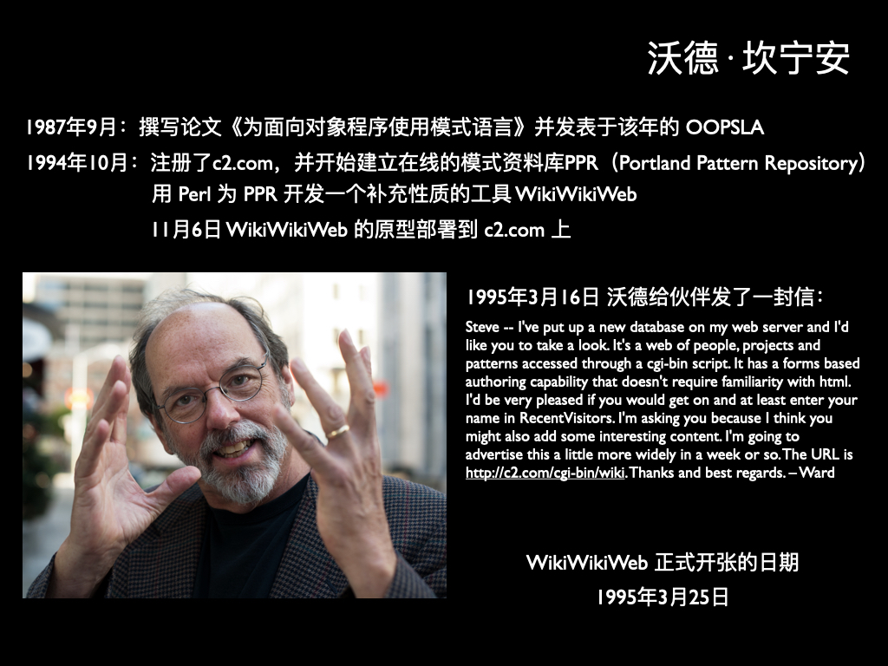

然而真正使 Wiki 技术得以光大的，还是维基百科的建立。2001 年 1 月 15 日维基百科计划上线，创始人是 Jimmy Wales 和 Larry Sanger。 
具体的故事可见诸众多文献，此处不予详述。

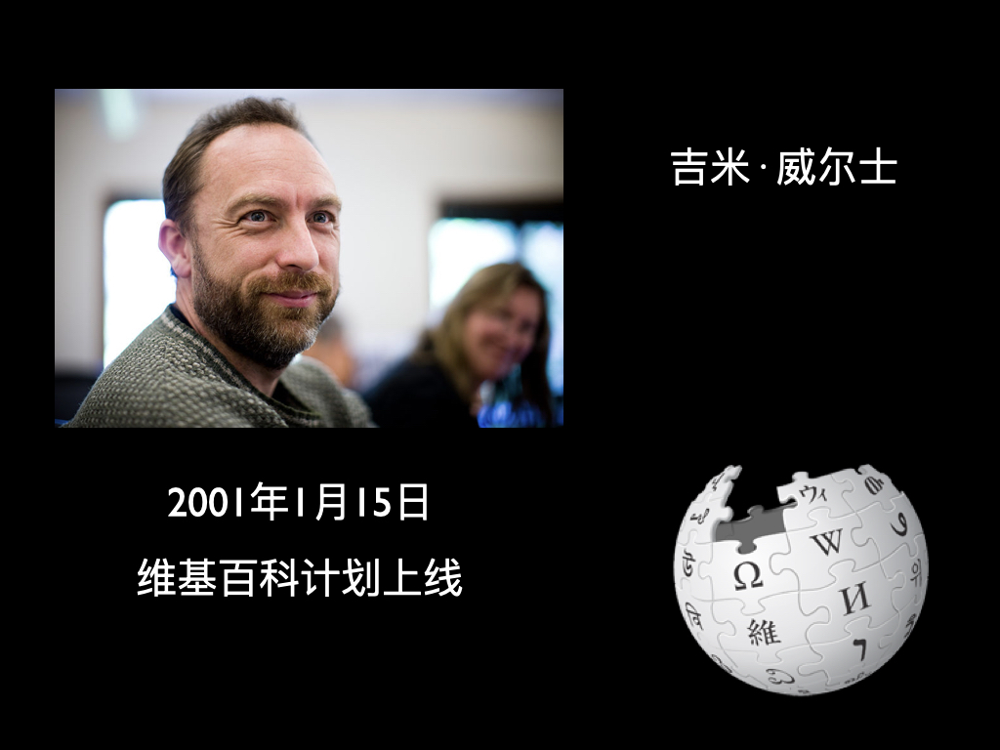

我们要说的，是不为大众知道的早期历史。Wiki 究竟什么时候最先引入的中文世界，就我们所了解到的情况，在2001年～2002年左右，
中文环境里有分散成几群的实践者，他们各自独立尝试这种新技术。

可查最早的中文维基软件是由索秘软件工作室（Softme Studio）发起的，在他们的 WebPM 项目下有 jWiki 子项目。
WebPM项目（Project Management On Web）的主要目标是为中文自由软件的开发者、使用者和推广者提供基于互联网的开放式管理平台。
jWiki 子项目第一阶段开始于 2001 年 12月 27 日，结束于 2002 年 01 月 14 日。相关开发者告知，ID 为“浆糊”的网友对这个阶段的贡献最大。
第一阶段结束后不久，他们就开设了一个测试站点 softme.org（已经废弃），来测试他们的维基系统。
此外 WebPM 项目的开发团队还是中文环境里比较早实践 XP 的团队。jWiki 项目在 2004 年依然活跃，曾经发布到 jWiki-v2.0.1 的版本。

2002 年 5 月份，中蟒大杂院开通。中蟒大杂院是一个修改过的基于 MoinMoin 的维基系统，服务于中蟒计划。中蟒是基于 Python 2.1.3 版的中文编程语言，
除了保留字，变量名称可用中文外，很多内建的数据类型也都是用中文来表示的。目前中蟒计划已不再维护，而中蟒大杂院在 2006 年之后也鲜有人编辑了。
中蟒大杂院的讨论主要集中在 Python 技术方面，而对维基自身的讨论比较少。

2002年10月，中文维基百科开始正式起步，它是到目前为止中文最大的维基站点。2002年11月初，贸大 Wiki 开通，它是对外经济贸易大学的校园 Wiki 网站，早已废弃不用。

在台湾，Schee (徐子涵)、hlb (薛良斌)是最早推动维基技术的先驱者，他们的 Blog 里都有 Wiki 的专栏。

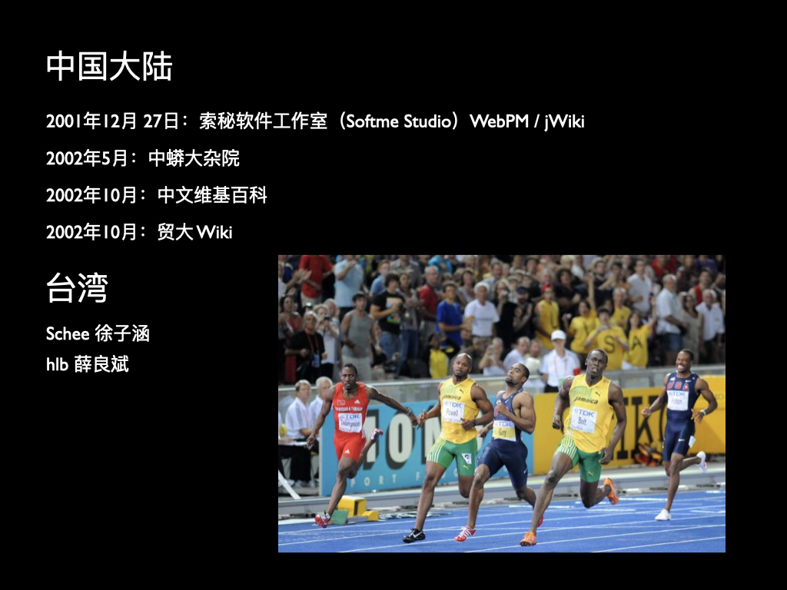

在这其中，短暂出现的贸大 Wiki 特别值得记录，它撰文探讨 Wiki 的开放性，给出了一个幽默的口号"一个民治、民有、民享的 Wiki 将永存于世！"
互联网的早期理想在这里回荡。

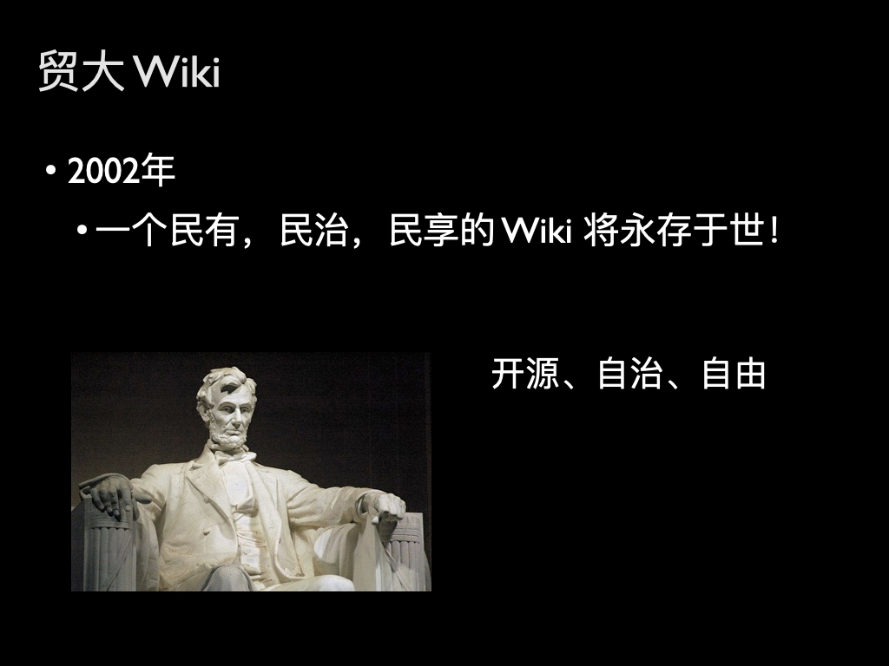

在随后的历史进程里，Wiki 技术和另外一种互联网上的软件形态 Blog 的发展交织在一起，当时 Blog 正在快速发展，Wiki 技术在 Blogsphere 里引起了很多的讨论。
最早在 2002 年底，中文 Blog 的先行者 cnblog.org 就开始了关于 Wiki 的探讨，我们对当时的讨论给出了一些吉光片羽式的记录，纪念那些逝去的时光。

2002年11月22日峨桥的主人 goghs 发了一篇介绍 Wiki 的文章
《Wiki/Wakka/Blog - 一点浅见》，他对 Wiki 的理解已经相当深刻了——

> “Wiki站点一般都有著一个严格的共同关注，Wiki的主体一般是明确的坚定的。Wiki站点的内容要求著高度相关性。最其确定的主旨，
> 任何写作者和参与者都应当严肃地遵从。Wiki的协作是针对同一主题作外延式和内涵式的扩展，将同一个问题谈得很充分很深入。
> Wiki非常适合于做一种 “All about something”的站点。个性化在这里不是最重要的，信息的完整性和充分性以及权威性才是真正的目标。
> Wiki由于其技术实现和含义的交织和复杂性，如果你漫无主题地去发挥，最终连建立者自己都会很快的迷失。
> Wiki使用最多也最合适的就是去共同进行文档的写作或者文章/书籍的写作。特别是技术相关的（尤以程序开发相关的）FAQ，
> 更多的也是更合适地以Wiki来展现。”

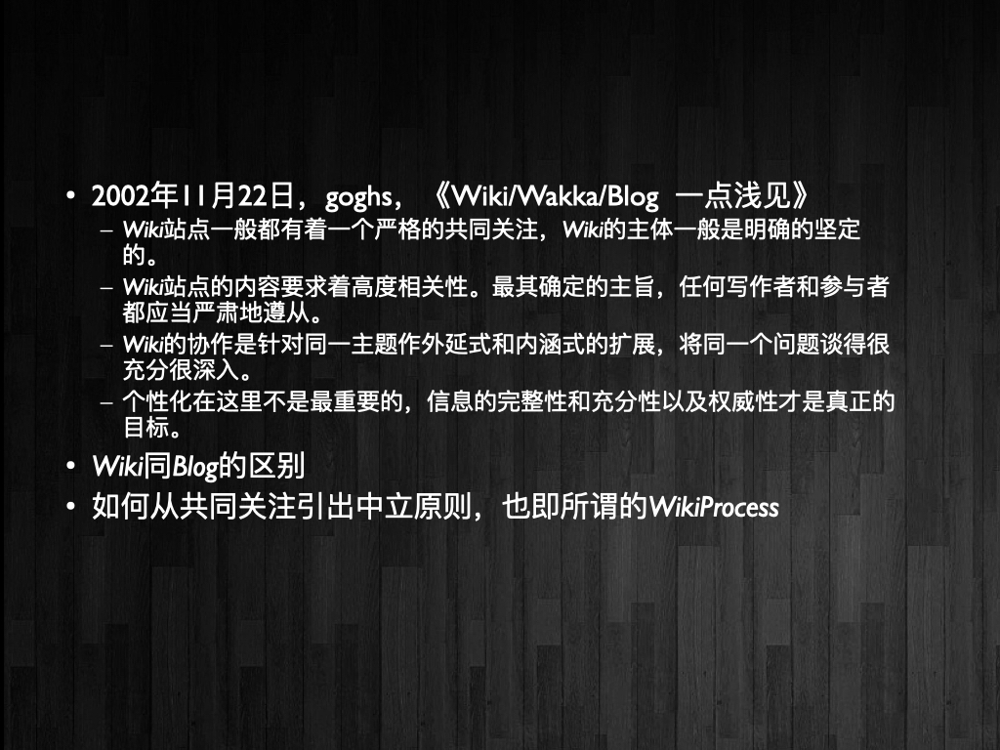

2004 年 6 月初 cnblog.org 上 Eric Nash《关于wiki的一些联想》引起了不少人的关注。
Eric Nash 从自己使用 Google 和 Wikipedia 的搜索习惯谈起，认为 Wiki 的庞大访问量和长时效的特点会弥补它在准确与权威上的问题，
又从信息组织方式的有序与无序的角度探讨Wiki和搜索引擎的不同，最后他得出这样的结论：

> “web是一个通过Link连起来的杂乱无章的世界，wiki的无非是人们在无序中寻求次序的本能需要，一个理想的web应该是杂乱无章无序世界加上一个
> 有序的庞大的wiki的有序世界，这两个相反的世界在web上又是共生共容，就相当与太极图上的黑白两个半圆——到最好总是那么简单和谐。”

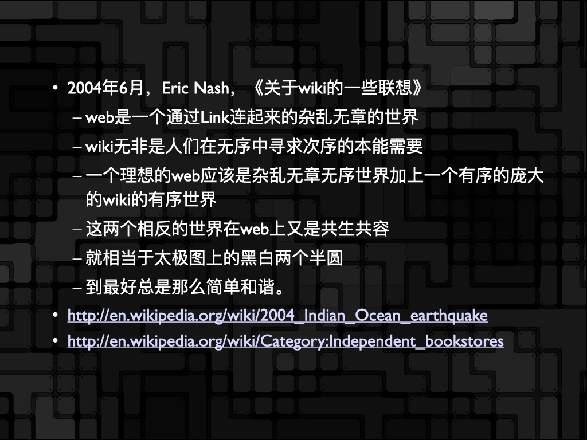

在这篇文章引发的讨论里，网友 maomy 的评论至今值得我们思考：

> “但是有一个问题，wiki对任何人的可写性，可能导致你今天刚写上去的内容就被人涂改了，甚至改的观点完全不同——这还不包括恶意破坏，
> 或者因强烈的观点冲突而删除你的原文重写的可能。理想的状态当然是每个人都足够认真严肃地去写wiki，但即便如此，
> 也不能保证我们能信任wiki中的大多数信息，因为我们都知道人的偏见和狭隘是多么难于克服。更何况，这种理想状态的达到都是非常困难的。”

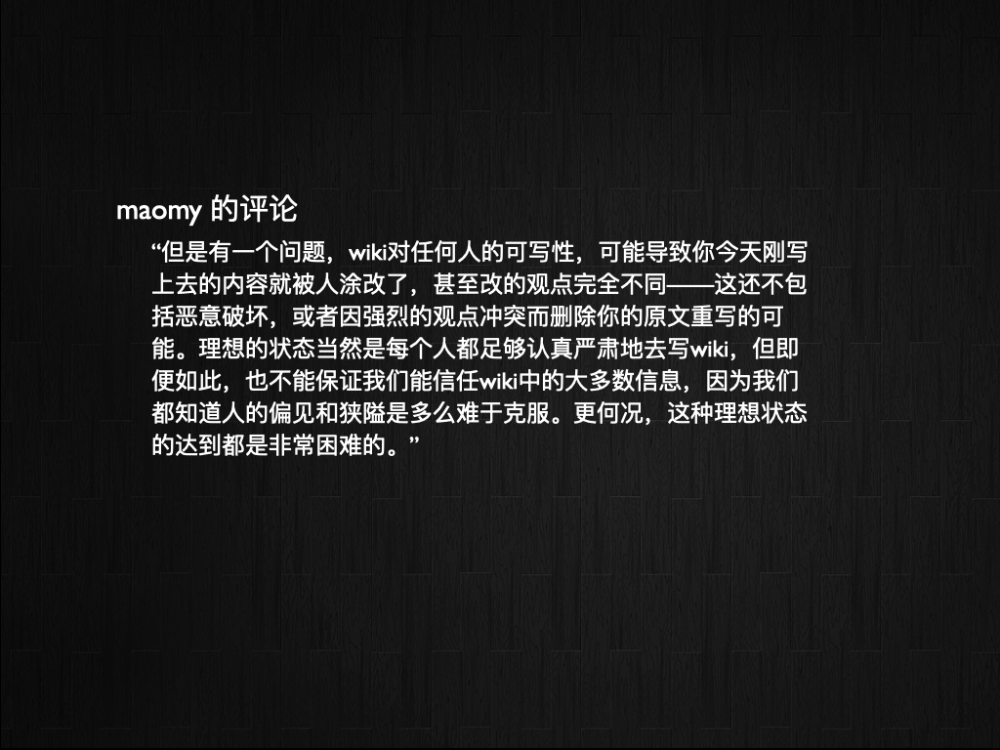

The Way We Web是中国大陆一位有影响的Blogger，他在 2005 年 1 月 18 日写了一篇 blog —《WIKI，感觉不仅仅是百科全书》，其中有一段这样说的：

> “百科全书试图将词条定义为某种相对静止从而可以把握的东西，而WIKI不一样，它既将这种相对的静止抽象出来，也记录了这一静止后面的流动不居的书写过程，
> 这二者的共存使人明白：历史无定论，任何东西都没有定论，历史就是我们书写时应该保持谦卑的那位主人。”

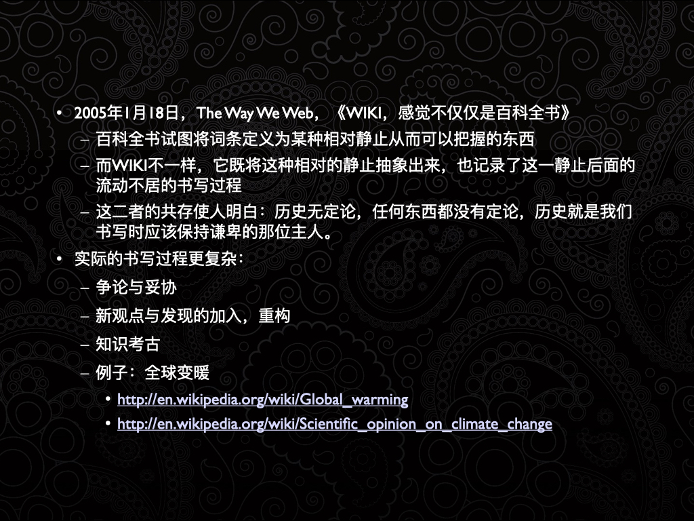

中文早期的 Blog 写手 Zheng 也撰文探讨 Wiki 无穷尽的生成能力和蔑视时间变化的特性。

> “如何才是Wiki区别于其他Web应用的不同之处呢？应该是如下两点？
> 1、无穷尽的网页自动生成功能：Wiki创建页面的方式一直让我很著迷。对其他文档处理程序来说，可以通过创建命令来创建出很多很多的文档，
> 但是文档之间并没有彼此的联系，它们就像散沙。可是Wiki不同，它不用特别的创建命令，在人们需要的地方，它就能够自动生成，
> 并且所成的页面和原来的页面存在一个由词构成的联结点。人们可以在Wiki上无限制的创建出新的页面，而这些页面，无论它们相距多远，
> 总存在千丝万缕的联系。它们是一个整体。是一个不断的、没有终结的在扩展的书。这种扩展无处不在，任何一个缝隙都能成为一个无穷尽迷宫的入点。
> 它没有距离、没有空间，但却有无穷尽的可能出现。它像不像人们所拥有的知识本身？像不像人们海阔天空的联想本身？
> 2、它超出时间之外，也就是它是可逆的：这实际上来源于Wiki的版本记录和恢复功能。和其他文档处理程序不同，
> Wiki把过程也作为他重点处理的对象和最终的文本地位一样。所有的变化都被记录，能够任意恢复到变化前的某一点。从这方面来说，时间对它无效。
> 从前台看，它一直向前，但是在后台，所有的历史、所有的数据都被保存。这是一个经典物理世界和现实世界的奇妙变异体。
> 一方面，谁也无法预知它的未来，另一方面，却可以回到过去。作为一个对比，人的状态可以被记录，但老去是不可逆的。 Wiki却可以。
> 那是否意味著，Wiki的独特之处在于对空间无穷尽的深刻理解和对时间的蔑视？”

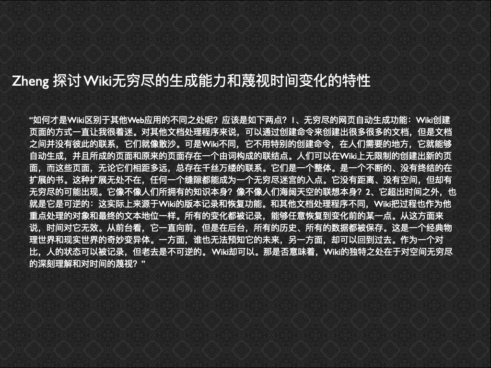

第三节：一家之杂谈

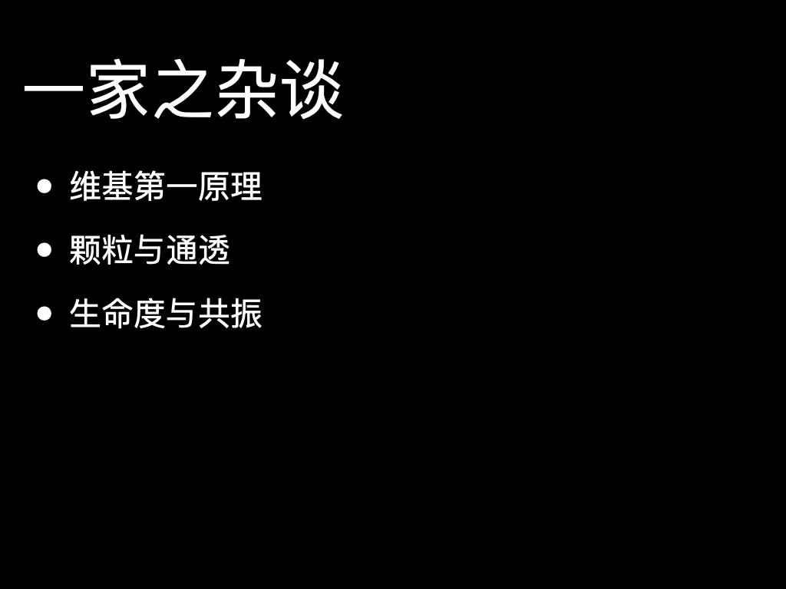

我个人把"名字即链接"视为维基的第一原理。

熟悉维基的用户都知道用括号括起来一个关键字，出现红链点击就可以创建新条目，而蓝链就指向已经创建的文章。名字和链接是一体的。

为什么这个如此简单的软件特性会成为"维基的第一原理"呢？让我们来做一个思想实验。

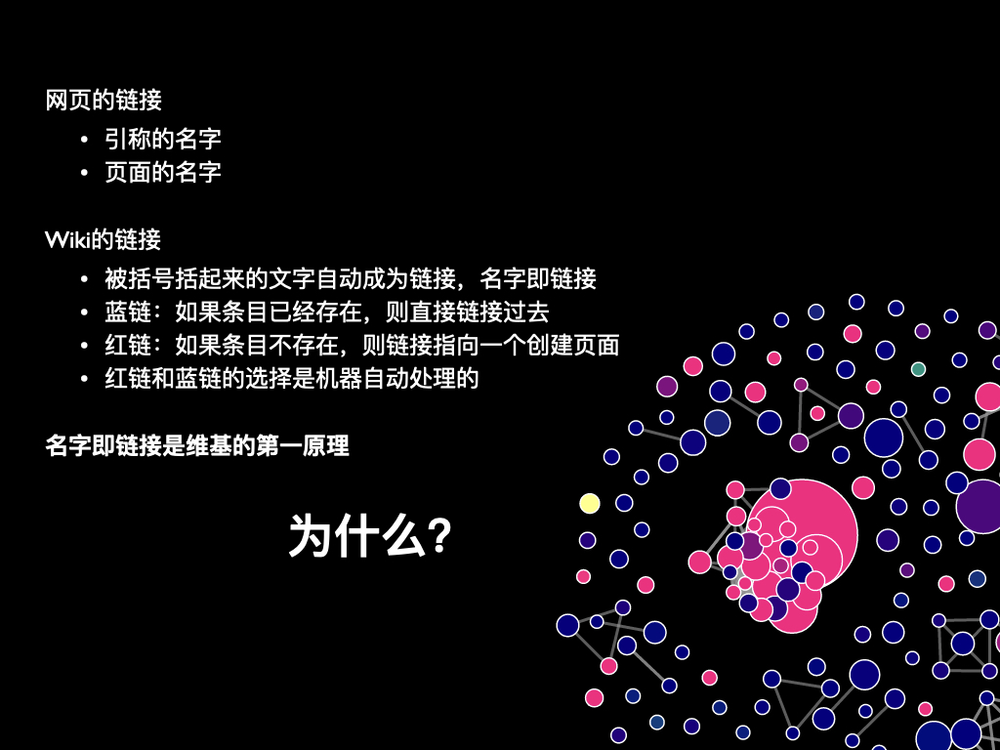

设想有如下两个设定：

* 情形一：我把一个苹果放在桌面上，让大家在 Wiki 里描述这个事物
* 情形二：我放一段牛顿被苹果砸的故事，让大家在 Wiki 里描述这个事情

然后，实验者在彼此互不知道别人写了什么的情况下，独自做贡献；在 Wiki 系统里会发生什么呢？

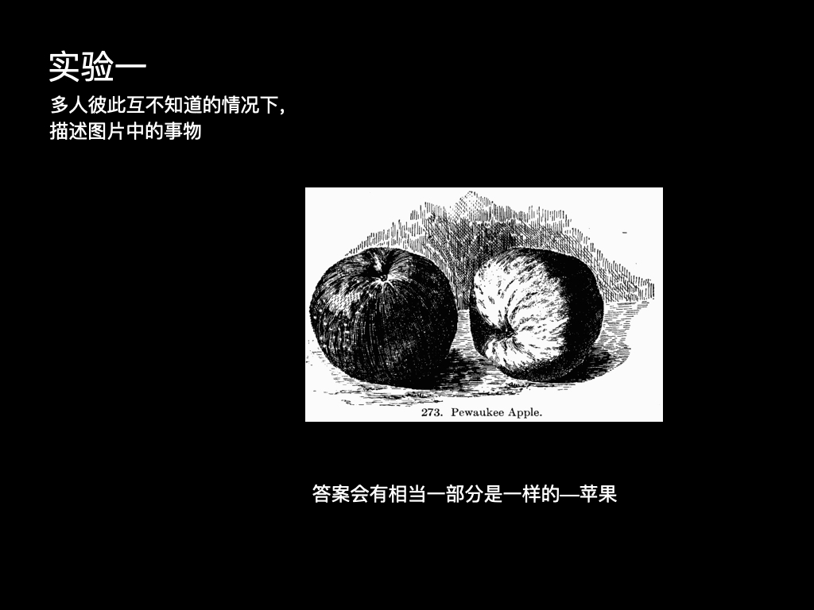

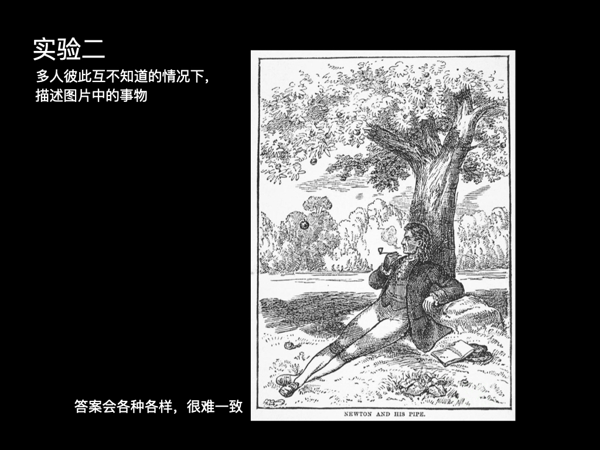

在情形一中，因为名字和链接是一体的，实验者很容易彼此呼应、链接起来。而如果名字和链接不同，这种呼应、链接就会断掉。

在情形二中，实验者很难建立彼此的链接，基本上会各自为战。

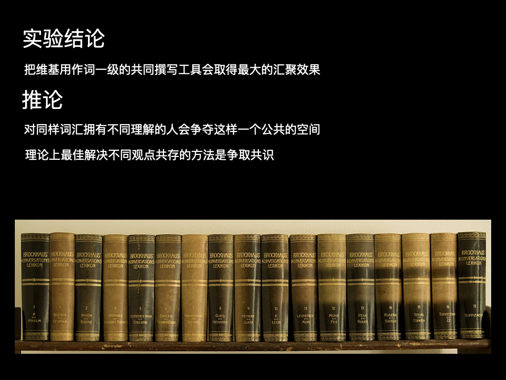

再仔细考察一下，我们会发现我们在讨论知识颗粒的通透性。

第一种情形描述事物的知识粒度比较小，而小颗粒的知识是非常容易彼此通透的。
这种不同知识颗粒有不同通透度的现象普遍发生在人类的知识交换过程中。

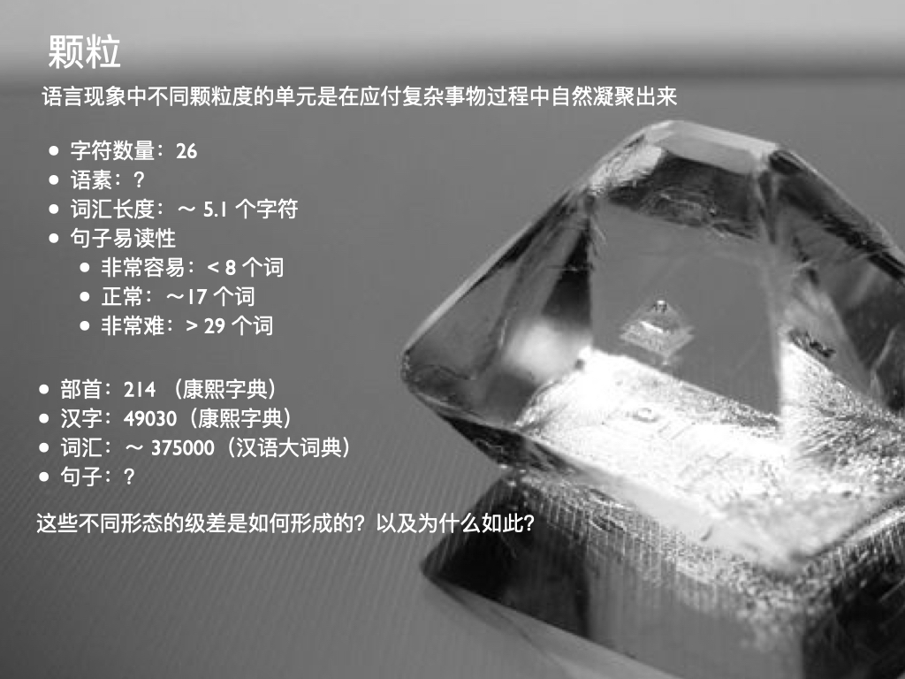

再考察 Wiki 在企业里的使用。在企业里知识颗粒是非常情景化的，只具备小范围的公共性。当这些颗粒进入 Wiki 系统，首先碰到的问题就是冲突。 
比如 A 小组有一个日程，B小组也有一个日程，但"日程"这个页面同时容纳 A、B 的两个日程，从实际运作的角度讲，是不合理的。
所以，我们需要把它们隔离起来。

而作为公共知识的积累，百科全书以概念为单位，刚好把通透性良好地运用起来，参与者的贡献都能彼此获得加成，这和企业环境是完全不同的。

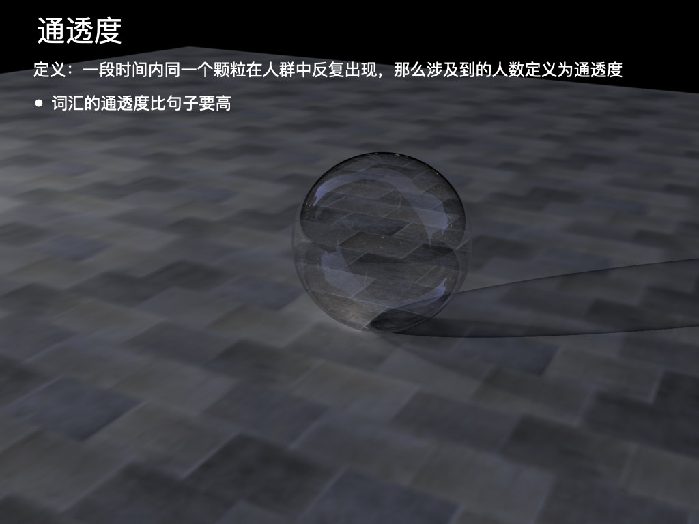

让我们重新回到建筑学家 Christopher Alexander（2022 年 3 月份离世）。在晚期，Christopher 提倡一种生命度的理论。
在他看来，不同的工具形态，像生命一样创造出来，然后反复复制，从而拥有不同的生命度。从这个观点看，维基百科是一个生命度特别高的工具。

在我的遐想里，我更想把知识颗粒同波动联系起来，当人和人、人和工具之间的知识波动形成共振的时候，知识就以颗粒的形态出现，从而就有通透性。
当人和人、人和工具之间的知识波动不能相互协调，它就以一种流动出现，拥有巨大的可能空间，从而形成一个墙，不再是彼此通透的。

从这个角度讲，能和周围的人和环境发生共振的工具，就是生命度高的工具。维基百科就是这种知识共振的结果。

