+++
title = "维基"
description = ""
date = 2012-10-11
weight = 0
draft = false

sort_by = "date"
paginate_by = 5
paginate_path = "page"
insert_anchor_links = "none"
in_search_index = true

template = "section.html"
page_template = "page.html"
transparent = false

+++

[下载](/downloads/wiki.pdf)：这个演示文档简单介绍了笔者理解的维基百科，给出了维基技术的历史和一些原理性的思考。

---

封面

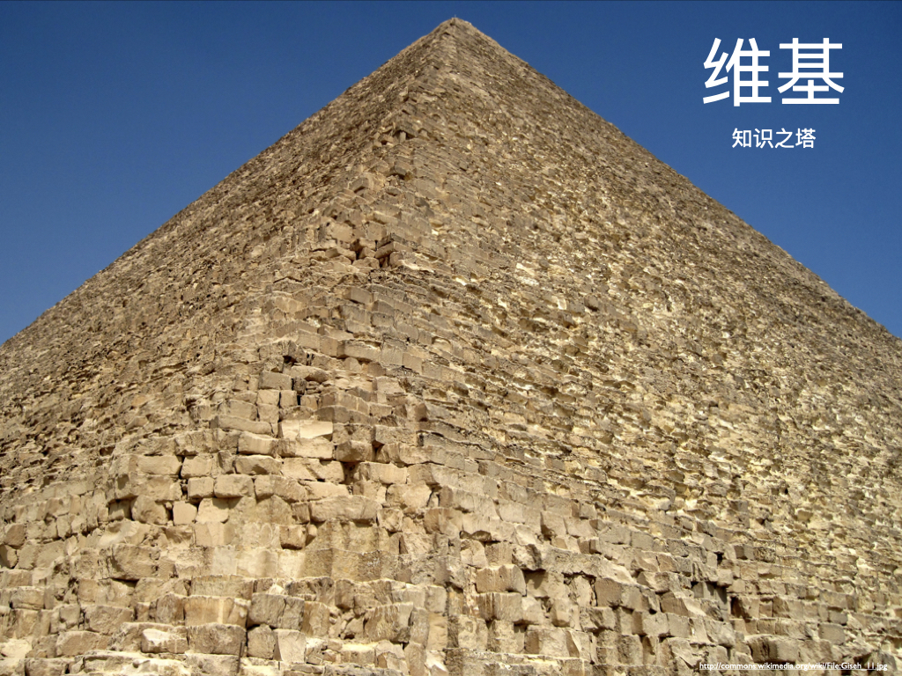

目录

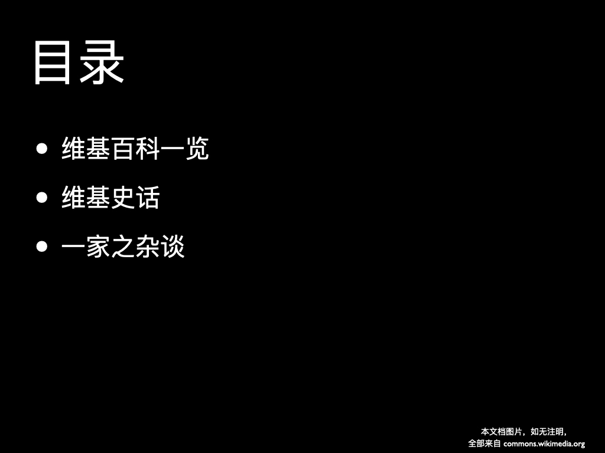

第一节：维基百科一览

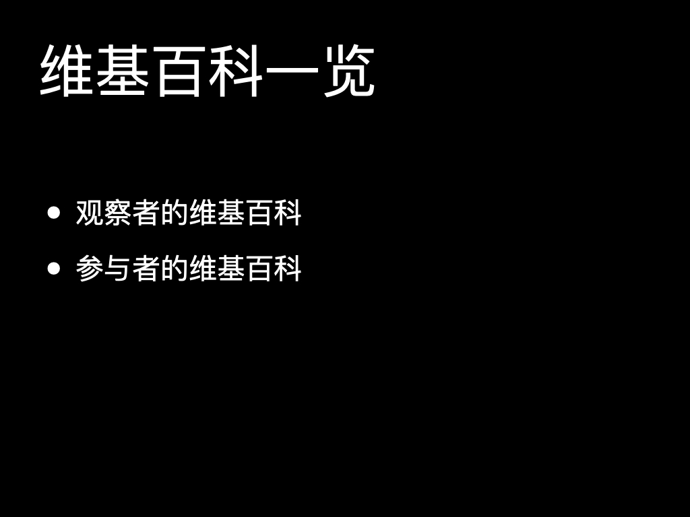

1948年建筑学家勒·柯布⻄耶在他的代表作《模度》一书中写道

> 生活对于人类来说说不是百科全书，她是个性化的……在生活面前，有些人不能无动于衷，相反，他们是生活的积极参与者......
> 因为在这里，一个人、一方⻛土、一种氛围、一份热情、一种局势、一些状况、一个机会，
> 它们构成一个历经纷繁生活环境的规律序列：局势，热情，矛盾，竞争，
> 一些事物的衰退，一些事物的兴起，一些特殊的条件，经历的变革……
> 而在图书馆的书架对面，百科全书在那儿，那些卷轴静静的排成行。

在他和当时的理解里，生活有观察者和参与者的区别，人们认为写百科全书的人，更多是生活的观察者。2012 年人们认为维基百科是大众智慧通过互联网放大后的结晶。
那么勒·柯布⻄耶的观点还成立吗？

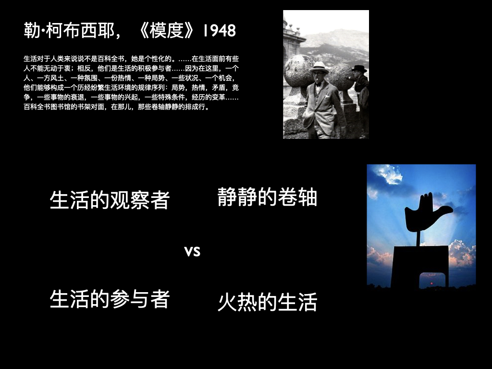

是的，我们仍然能在维基百科上看到观察者的身影；不过也有一些参与者的活动。让我们通过特色条目来看一看今日百科的情形。

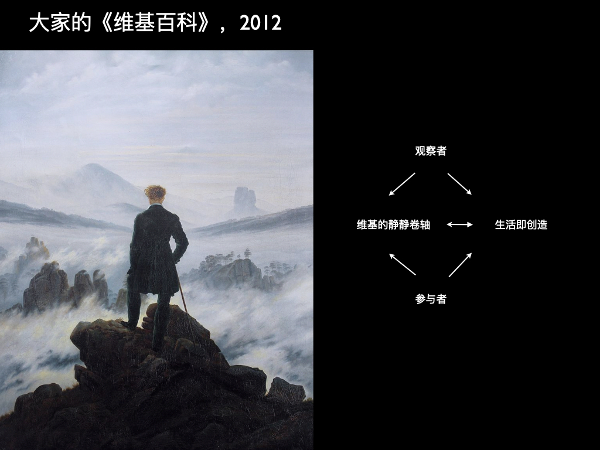

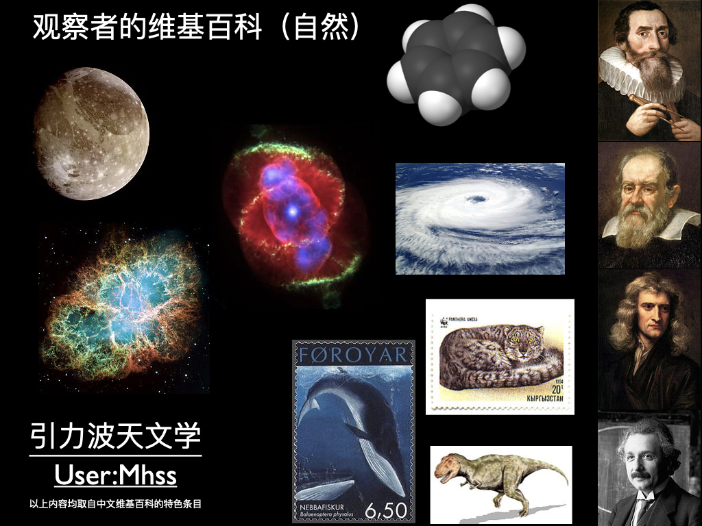

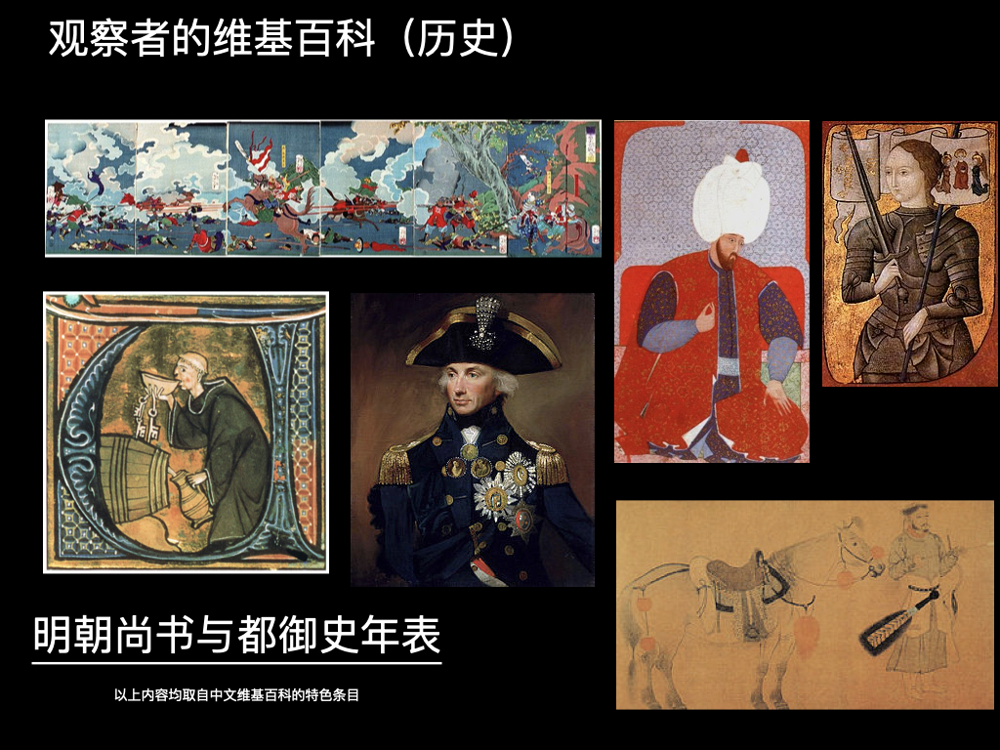

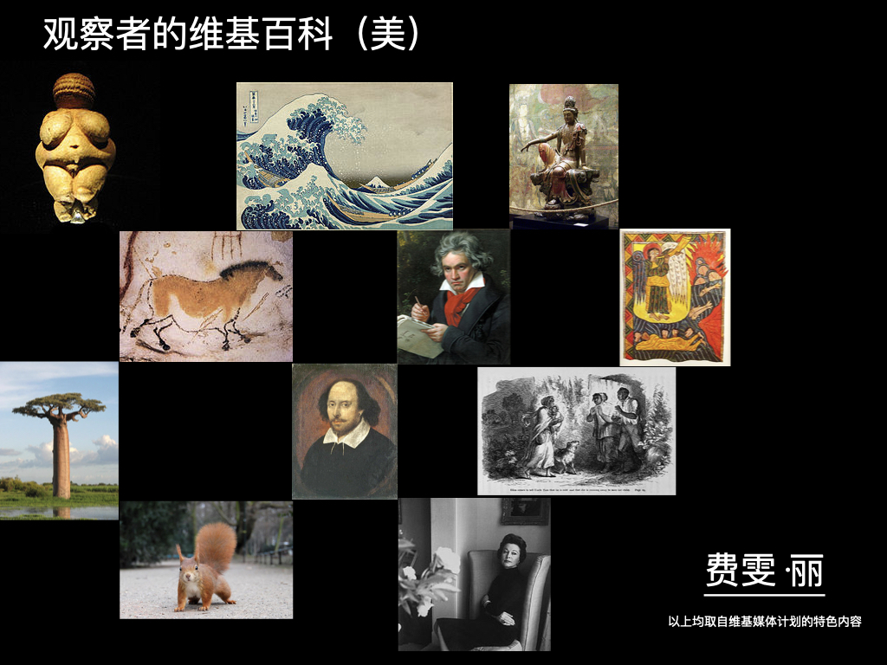

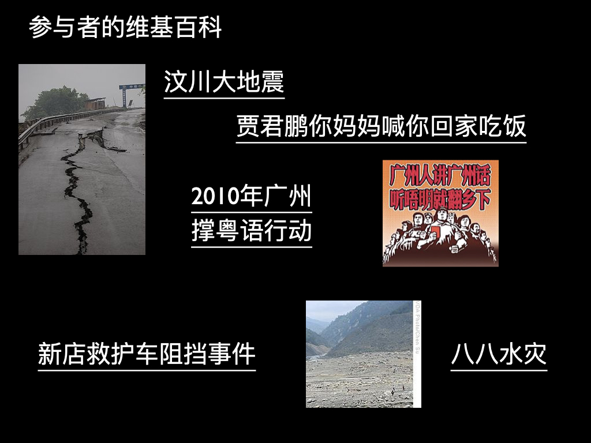

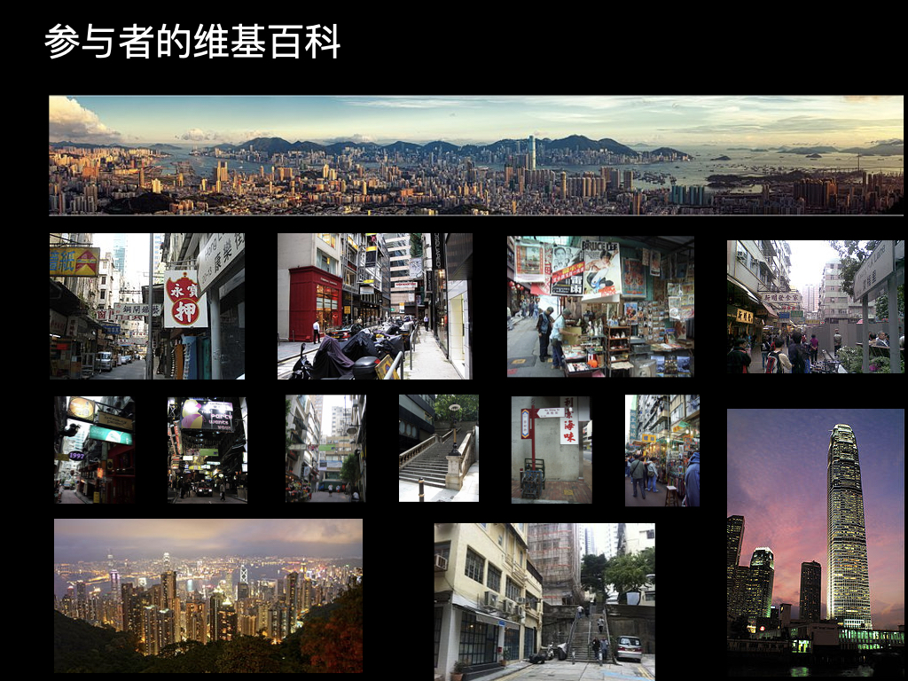

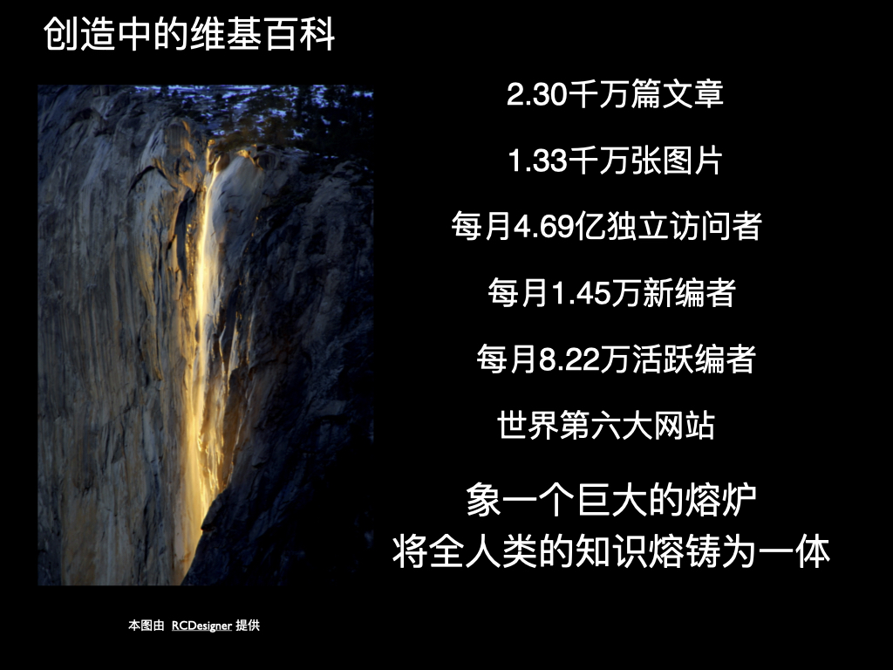

第二节：维基史话

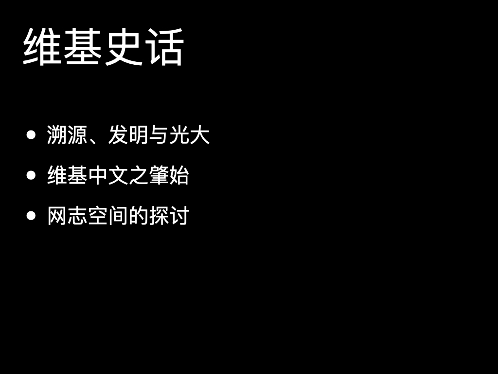

第三节：一家之杂谈

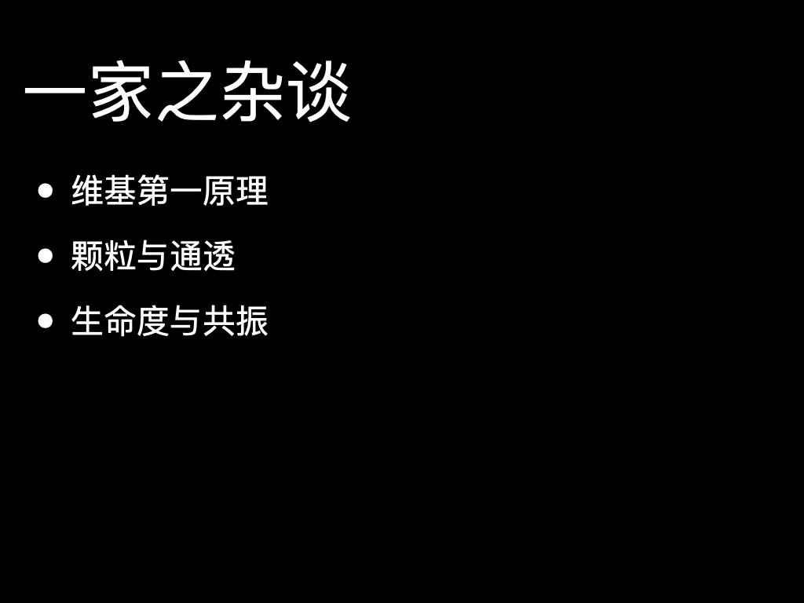

