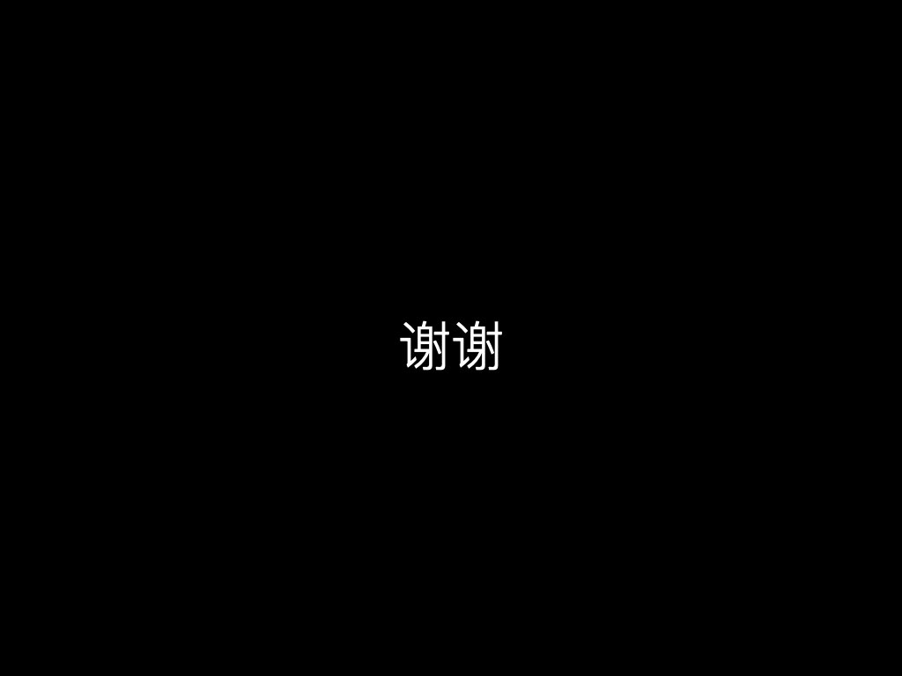

+++
title = "凿空厚壁"
description = ""
date =2018-09-11
weight = 0
draft = false

sort_by = "date"
paginate_by = 5
paginate_path = "page"
insert_anchor_links = "none"
in_search_index = true

template = "section.html"
page_template = "page.html"
transparent = false
+++

[视频](https://www.bilibili.com/video/BV1Lb411p7jL)
[讲稿](/downloads/digging.pdf)

大家好，我是苑明理，一位工程师。今天我想给大家分享的题目是《凿空厚壁：得见星空》。

我想在开始之前先问一下大家，有多少人是我们“大刘”—刘慈欣—的读者？有一些朋友已经提到《三体》，但是我今天这个题目其实跟《三体》没有关系，相关的倒是另外一部小说。

这部小说是刘慈欣的非常出色的一个作品，叫做《山》。它讲述了一个故事中的故事。它从这样一个设定开始：
有一个行星，在它的地核里，就是它星球最核心的那一部分，里面有一个文明世界。 这个文明世界里的人，通过一种叫做泡船的东西，就是我后面这幅图里的小泡泡，开始探索周围的世界。
他们用了 10 万年的时间，历尽千辛万苦，终于从地核抵达到了这个行星的表面。小说里描写了一个非常让人激动的场面：他们可以遥望头顶的星空，看到一幅壮美的图景。 
所以我用"凿空厚壁"这句话来作为我这次演讲的题目。我下面要讲的东西，在内容上其实跟这个行星完全不一样，可是在寓意层面上，两者有很深的关联。

下面我先给大家简单地介绍一下我创造的瓦克星的设定。 我们的飞船马上就要出发了，飞往的目的地就是瓦克星的世界。

它是什么样的星球呢？它比地球略微大一点。我们可以在图示的上面看到地球和太阳系，下面就是瓦克星和它的太阳在一起。它有两个太阳，围绕这两个太阳在旋转。
而且我们这两个太阳中，一颗是黄星，较暗的一棵星；一颗是蓝星，光亮程度稍高。然后我们的飞船在逐渐逐渐飞临瓦克星，我用计算机模拟出来的一幅画。

我们在太阳系，看到的星体都是像月牙一样的形状，或者是满月之后凸出来的那种形状。但在这里大家可以看到图像是像一个鸭梨一样的形状。为什么呢？
因为在这个星系里，它有两个太阳的光芒在照耀，所以就形成了这样一幅图案。

一句话来概括我这个计划就是：我想通过模拟一个有两个太阳的行星世界，把上面的山川、海洋、风雷雨点甚至生物都模拟出来。
然后通过这样一个过程，来促进物理、数学和计算机知识的教育。

它是一个教育项目不是一个科研项目。如果是实际科研的话，有太多的未知因素是我们无法确定的。但如果我们设定了这个场景，跟地球略微类似，却有稍有不同的话，
我们就可以在这个模拟过程中发现很多有意思的事情。

我设计了一条探索的路径。首先我们要进行行星系的建模，我们要确定一些几何关系。 确定一个行星的稳定的轨道，探索一下上面怎样才是一个适合生命居住的环境；
然后我进行行星建模，把行星表面上的物理环境给刻画清楚。当光、热、水的条件都具备了，我们甚至可以去考虑上面的生命。 生命这个阶段，我目前还只是简单的想了一下，
只做了比较少的探索。最后，我们甚至可以去探讨，在这样一种环境下，他们的文明会具有怎样的观念。

我先简单展示一下我模拟出来的初步成果。

这幅图是一个地图，大家可以看到黄色的部分和蓝色的部分，黄色的部分是黄星照射的区域，蓝色的部分是蓝星照耀的区域，而白色的部分是这两颗恒星同时照耀的区域。
跟地球上稍微不一样的地方在哪里呢？ 我们知道在地球上当我们的一个地极处于极昼的时候，那么另一个地极一定处于极夜。可是在这个恒星上，它一年中总会有那么短暂的几天，
它的两极分别在两个太阳的照耀之下。我在设想，如果这个行星上有一个文明的话，这几天可能会成为他们的节日。这是一点不太一样的地方。

下面进行到行星建模的部分，我考虑了怎么样把它的陆地和海洋，甚至山川、高原，低地这些都模拟出来。我通过一种分形算法，达到了这个目的。

我还甚至考虑去模拟上面的大气。我们可以用一种非常简单的微分方程把大气的几种状态刻画出来，然后就让这个系统演化。下面的这幅图是我们模拟的初期。
它有红色和蓝色两部分。蓝色表示的是温度比较低，红色表示是温度比较高。这是一个大气的垂直的剖面图，我们看到下面是接近地表的部分，上面的部分就是高空。
高空是冷的，下面是热的。光线照耀到地表，然后地表去加热大气，这是模拟一开始的场景。随着模拟的推进，我们就会发现，慢慢的，中间这一层就变成一个低温层，越往高处温度越高，从中间层往低处走也是温度变高。这个结果其实刚好跟地球上是一样的。
就是说会出现两个层次的大气。第一个层次是底下的对流层，因为高空的空气是冷的，空气会往下降，而且形成对流，比较丰富的天气现象会在里面发生。
上面的部分叫做平流层。在瓦克星上，这跟地球上是一模一样的。这个结论当时让我兴奋了好几天。

然后我做了简单的设计，尝试模拟上面的植物。我模拟了植物的生长，在数学里有一个完美的系统叫做 L-system 可以把植物的生长完美的刻画出来。
我更想去做但目前还没有去做的是：在这样的一个环境里，植物会是怎样的形态？它跟地球不一样，它的光线照射、水也是不一样的。怎样的植物形态才是更合适的形态？
这是我目前想去探索的，但是还没有做的。 

我们简单结束对瓦克星物理世界的一个描述。下面我想步入一个更有意思的环节，尝试去看一下它上面的文化系统。 我会带领大家去看一下它上面的空间观念、时间观念以及数字观念是什么样的？

我现在先进入到第一个环节：空间。 现在有一个非常热的词叫增强现实。大家可能会认为增强现实是一个非常酷的科技名词，比如说谷歌眼镜的例子。
那大家有没有问过自己，最早的增强现实是什么？是最近才发明出来的吗，还是很早以前就有？我有一个看法：最早的增强现实其实在很久很久之前就已经出现了，比如说四方位。
方位感其实是生物内在的生理机制，但人类的空间秩序是一种文化的产物，它不是这个世界本身就具有的一种东西。

可以设想一下，很久很久很久之前，原始人走出了洞穴，他们看到远处有一座山，或者是一条河流，给它们命名比如黄浦江、佘山。这是人类赋予自然界，而不是自然世界固有的。这是命名。
我们出门要怎么走才能到佘山？比如说要往西走。这个“西”其实是人类赋予这个空间一种秩序，是赤裸裸的物理世界里没有的属性。

所以我认为地名和四方位，就是最早的增强现实技术。它其实很久很久之前就发明了。 右侧这个图案是在金沙出土的一个四鸟环乌考古遗物，它告诉我们：
古人是对太阳的运转有了深刻的观察和理解之后，才提出了四方位的概念。

大家可以看一下这幅图，这是国际空间站拍摄的上海和苏州的上空的夜景。大家可以看到苏州清晰的街区这种网状结构，而且街区是沿着东西和南北方向展开。
可以想象，人类发明了东西南北观念之后，这种观念物化到我们的环境当中，我们后来人一出生就接触到了有东西南北这种观念的一个世界，可能就从来不奇怪，
也不去想东西南北是什么，因为地标从来里就有这种东西。但其实这会使我们处于一种麻木的状态，体会不到事物最本质是层面。
瓦克星给我们提供了一个机会，让我们可以问一下，在这个星球上，它的东西南北究竟是什么？

比如太阳从东边出从西边落，但在地球上我们要精确的定义正东和正西的话，必须在春秋分才能达到。但对瓦克星来说，怎么样定义它的春秋分呢？它的轨道是零乱的，不是那么规整的一个圆。
另外，我们可以把一天内日影最短的那个方向定义为南方。但瓦克星有两个太阳，你怎么定义正午时光呢？北极星指北是我们最常见的一个说法。
但北极星的存在是一个偶然，地球是旋转的，在地球上某些时刻因为有岁差的原因，也可能看不到北极星，那我们怎么定义北？

所有这一切，会迫使我们去思考究竟什么是东西南北。 我自己是走了一段弯路才认识到这个问题。
我一开始认为，北半球的中纬度地区的房子指向是朝南，因为采光量在这个方向上是最大的。我于是设计一个程序然后让它跑，跑了好久最后得出一个结论：算出来的方向刚好就是经线的方向。
我那一刻才恍然大悟，原来东西南北的本质是来源于行星旋转那个稳定的地轴。沿着地轴稳定的指向，我们就可以把东西南北顺利地定义出来。

所以说，我们因为生活在已经有东西南北的一个世界里，就可能不去思考它是怎么被创造出来。这种懒得思考、麻木僵化的思维，就是主题—凿空厚壁—里所指的“厚壁”。
这也符合刘慈欣小说里的原意，厚壁不单是指要攻克的行星从地核到地表的物理空间，还包括我们内心世界；最开始我们是无知的，有一个错误的判断，
但是随着探索的深入，我们把这个错误消除了，于是就认识到了一个更加真实、真切的世界，这就是我这次演讲主要想强调的。

好，下面我们看一下历法。

我们先看一下地球上的考古遗物。这是一个新石器时代的骨头，上面可以看到这些小点，它们记录了地球上月象的变化。
这边是柏林德国国家历史博物馆的一个金属帽子，它是青铜时代人们记录时间的一种日历。 于是，大家可以看到，通过对某种天文现象的观测，人类确定了地球上计时的一个周期。
那么，我们就可以问瓦克星上最显著的天文现象是什么？

我经过一段时间的思考，得出了一个结论，在瓦克星上其实最壮观的一个天文现象就是日食，但它和地球略微不同——它是交错出现的两种日食。
大家首先看到的是地球上新西伯利亚地区的一次日食，这个日食的景象非常壮观。在瓦克星上，大家可以设想一下上面日食的场面，它会是另外一种非常壮观的情况，
跟地球上先亮再变暗再变亮的过程不一样。

第一次是黄星从蓝星前面经过，接着下一次，就是蓝星从黄星的前面经过。天空一开始是由两颗恒星照耀是一种颜色，当黄星从蓝星前面经过的时候，
这个世界的光线就会变得越来越暗，同时越来越黄；然后，光线颜色发生变化又慢慢复原，恢复到先前的光明程度和色彩。接下来是交错的下一场日食， 那个时候天空先变暗，变蓝然后再变黄。
这种交错出现的两种日食跟地球上非常不同。 在此基础上，那里的智慧生物就可以以此定义一种时间周期，来确立一种称为"食历"的历法。

地球上的文明成就还有一种：《尚书·尧典》里记载了先人怎么通过观测恒星的位置，来判断一年的四季。这里用到的方法就是判断恒星的位置。

在瓦克星上也可以通过观测背景星空来确定它的时间，但这里就不再是一个简单的周期，而是一个类周期的现象，这样我们可以就可以定义另一种"星历"。

更有意思的问题是，地球上有四季的说法，它和植物的生长有关系，是一种农业历。在地球上，农业历跟天文历的周期是吻合的。 那么在瓦克星上会成立吗？
让我们看一下模拟。我们看到两个星体的旋转，和光线在纬度上的分布。从底下这根线，我们可以看到的行星接收能量的大小变化。

通过分析这个能量变化，我发现这个周期是几年的，而不是一年。于是，我们就可以得到一个结论：瓦克星上有着非常复杂的气候变化，不是简单的四季，周期远大于一年，是一种多年的不重合的类周期。

下面让我们进入到数学的部分。大多数朋友都会有一个印象，数在逻辑上是非常坚实的。那么，我想让大家看一下，数其实还可以有多种不同的选择。

古代埃及文明做乘法的一种方式，比如11×35，古代埃及人是先把11写在这一侧，然后35写在这一侧，然后他们一次把它们都扩大二倍，在左侧我们就得到了1248，在右侧我们得到了35、70、140、280，他们会发现1+2+8刚好是11，于是他们就把右侧的35跟70跟280加在一起，最后他们能得到一个正确的数。
这种方法可能显得非常笨非常原始，跟我们现代人用的方法不一样。我们现代人用的方法更多地依托于乘法表，我们从小就背的小九九，大九九，总共是81项。

但对古巴比伦文明来说，他们是一种60进制的数制。那对于一个60进制的文明怎么去做乘法呢？难道还要背一个乘法表吗？
如果背乘法表的话，总共有3600项，这是任何一个普通智力的人都做不到的。他们怎么样才能把乘法运算做出来呢？

人们猜测了一些非常巧妙的方法，比如通过一个平方表来实现。因为A+B的平方等于A的平方加上B的平方再加上2AB，利用这个关系，我们就发现，A+B和的平方，减去A的平方，再减去B的平方。
这个差出来之后再除以2，刚好就是A×B。 换句话说，我们可以构造另外算法，它以平方关系为基础，只需要配合减法和除2的操作，就能顺利的完成乘法。
这是完全不同的一种心理过程，我们竟然还可以通过别的方法来实现乘法操作！

下面回到我的结语部分。我们日常生活中有很多习以为常的观念，当来到另一个完全陌生的环境，这些原有的观念就不能简单成立，我们得去设想另外的一些方法来方便我们生活。

古代中世纪时代的一个神学家 Nicole Oresme，他有一种宇宙观：上帝眷顾的世界，并不只有我们的一个，而是有很多很多的可能。这是一种哲学上的形而上探讨。

头几年我们发射了 Kepler 卫星。在卫星帮助下，我们观测了天空中很小的一个区域，就是大家在图上看到的那个方块的区域，就已经发现了几千颗行星，
这些行星中，可能有一些会类似地球这样有水存在的，我们称它们是处于宜居带的行星。 

于是我们可以肯定，在如此浩缈的一个宇宙空间里，一定有非常多的行星世界。
于是，我们不能不有一种发自内心深处的疑惑—我们的位置究竟在哪里？
最后，希望我们可以存有一颗谦卑的心，意识到宇宙如此之大；同时还能保持一份敏感，令我们体会到大千世界的众多不同；
在这种最深切的好奇的感召之下，让我们去探索广阔的宇宙。

谢谢大家。
